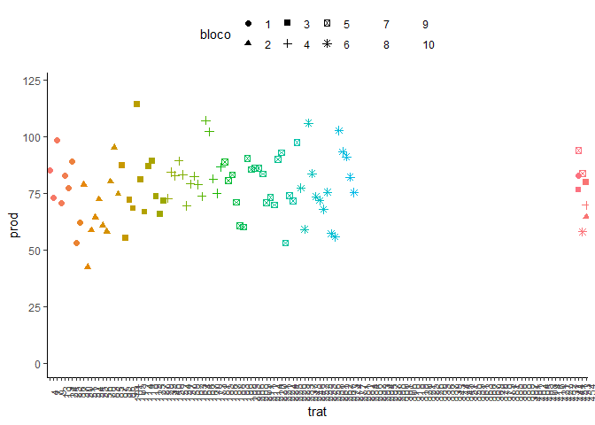
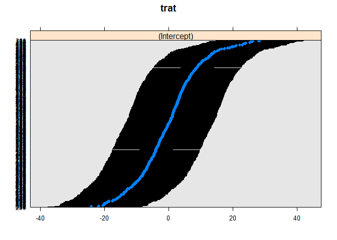

<!-- README.md is generated from README.Rmd. Please edit that file -->

# Análise de Blocos aumentados

## Carregando os Pacotes

``` r
library(tidyverse)
library(agricolae)
library(emmeans)
library(lattice)
library(desplot)
library(MASS)
library(lme4)
```

## Pressuposição da análise de variância

### Entrada de dados para o objeto `dba`

``` r
dba <- read.table("data/altura1920.txt",header=T)
```

``` r
glimpse(dba)
#> Rows: 490
#> Columns: 4
#> $ bloco <int> 1, 1, 1, 1, 1, 1, 1, 1, 1, 1, 1, 1, 1, 1, 1, 1, 1, 1, 1, 1, 1, 1~
#> $ tipo  <chr> "teste", "teste", "teste", "teste", "TR", "TR", "TR", "TR", "TR"~
#> $ trat  <int> 451, 452, 453, 454, 1, 2, 3, 4, 5, 6, 7, 8, 9, 10, 11, 12, 13, 1~
#> $ prod  <dbl> 82.8, 82.8, 53.8, 51.6, 90.6, 77.4, 104.6, 85.4, 81.6, 42.4, 73.~
DBA <- dba %>% 
  mutate_at(vars(bloco, trat), as_factor)
glimpse(DBA)
#> Rows: 490
#> Columns: 4
#> $ bloco <fct> 1, 1, 1, 1, 1, 1, 1, 1, 1, 1, 1, 1, 1, 1, 1, 1, 1, 1, 1, 1, 1, 1~
#> $ tipo  <chr> "teste", "teste", "teste", "teste", "TR", "TR", "TR", "TR", "TR"~
#> $ trat  <fct> 451, 452, 453, 454, 1, 2, 3, 4, 5, 6, 7, 8, 9, 10, 11, 12, 13, 1~
#> $ prod  <dbl> 82.8, 82.8, 53.8, 51.6, 90.6, 77.4, 104.6, 85.4, 81.6, 42.4, 73.~
```

``` r
DBA %>% sample_n(150) %>% # amostrando somente uns 150
  ggplot(
       aes(y = prod,
           x = trat,
           color = trat,
           shape = bloco)) +
  geom_point(size = 2) + # scatter plot with larger dots
  ylim(0, NA) + # force y-axis to start at 0
  guides(color = "none") + # turn off legend for colors
  theme_classic() + # clearer plot format
  theme(legend.position = "top",
        axis.text.x = element_text(angle = 90)) # legend on top
```

<!-- -->

## Anova

``` r
bloco <- factor(DBA$bloco)
trat <- factor(DBA$trat)
yield <- DBA$prod
```

## Delineamento em blocos aumentados

### Análise intrablocos via `agricolae::DAU.test`

``` r
model <- DAU.test(bloco, trat, yield,
                  method = "tukey",
                  console=TRUE)
#> 
#> ANALYSIS DAU:  yield 
#> Class level information
#> 
#> Block:  1 2 3 4 5 6 7 8 9 10
#> Trt  :  1 10 100 101 102 103 104 105 106 107 108 109 11 110 111 112 113 114 115 116 117 118 119 12 120 121 122 123 124 125 126 127 128 129 13 130 131 132 133 134 135 136 137 138 139 14 140 141 142 143 144 145 146 147 148 149 15 150 151 152 153 154 155 156 157 158 159 16 160 161 162 163 164 165 166 167 168 169 17 170 171 172 173 174 175 176 177 178 179 18 180 181 182 183 184 185 186 187 188 189 19 190 191 192 193 194 195 196 197 198 199 2 20 200 201 202 203 204 205 206 207 208 209 21 210 211 212 213 214 215 216 217 218 219 22 220 221 222 223 224 225 226 227 228 229 23 230 231 232 233 234 235 236 237 238 239 24 240 241 242 243 244 245 246 247 248 249 25 250 251 252 253 254 255 256 257 258 259 26 260 261 262 263 264 265 266 267 268 269 27 270 271 272 273 274 275 276 277 278 279 28 280 281 282 283 284 285 286 287 288 289 29 290 291 292 293 294 295 296 297 298 299 3 30 300 301 302 303 304 305 306 307 308 309 31 310 311 312 313 314 315 316 317 318 319 32 320 321 322 323 324 325 326 327 328 329 33 330 331 332 333 334 335 336 337 338 339 34 340 341 342 343 344 345 346 347 348 349 35 350 351 352 353 354 355 356 357 358 359 36 360 361 362 363 364 365 366 367 368 369 37 370 371 372 373 374 375 376 377 378 379 38 380 381 382 383 384 385 386 387 388 389 39 390 391 392 393 394 395 396 397 398 399 4 40 400 401 402 403 404 405 406 407 408 409 41 410 411 412 413 414 415 416 417 418 419 42 420 421 422 423 424 425 426 427 428 429 43 430 431 432 433 434 435 436 437 438 439 44 440 441 442 443 444 445 446 447 448 449 45 450 451 452 453 454 46 47 48 49 5 50 51 52 53 54 55 56 57 58 59 6 60 61 62 63 64 65 66 67 68 69 7 70 71 72 73 74 75 76 77 78 79 8 80 81 82 83 84 85 86 87 88 89 9 90 91 92 93 94 95 96 97 98 99
#> 
#> Number of observations:  490 
#> 
#> ANOVA, Treatment Adjusted
#> Analysis of Variance Table
#> 
#> Response: yield
#>                            Df Sum Sq Mean Sq F value    Pr(>F)    
#> block.unadj                 9  12641 1404.55                      
#> trt.adj                   453 102744  226.81  3.1808 0.0003081 ***
#> Control                     3   6293 2097.60 29.4173 1.167e-08 ***
#> Control + control.VS.aug. 450  96451  214.34  3.0059 0.0005242 ***
#> Residuals                  27   1925   71.30                      
#> ---
#> Signif. codes:  0 '***' 0.001 '**' 0.01 '*' 0.05 '.' 0.1 ' ' 1
#> 
#> ANOVA, Block Adjusted
#> Analysis of Variance Table
#> 
#> Response: yield
#>                       Df Sum Sq Mean Sq F value    Pr(>F)    
#> trt.unadj            453 113522  250.60                      
#> block.adj              9   1863  206.95  2.9023   0.01540 *  
#> Control                3   6293 2097.60 29.4173 1.167e-08 ***
#> Augmented            449 107125  238.59  3.3460   0.00019 ***
#> Control vs augmented   1    104  104.15  1.4606   0.23732    
#> Residuals             27   1925   71.30                      
#> ---
#> Signif. codes:  0 '***' 0.001 '**' 0.01 '*' 0.05 '.' 0.1 ' ' 1
#> 
#> coefficient of variation: 11.3 %
#> yield Means: 74.89133 
#> 
#> Critical Differences (Between)
#>                                               Std Error Diff.
#> Two Control Treatments                               3.776374
#> Two Augmented Treatments (Same Block)               11.941943
#> Two Augmented Treatments(Different Blocks)          13.351498
#> A Augmented Treatment and A Control Treatment        9.720037
#> 
#> 
#> Treatments with the same letter are not significantly different.
#> 
#>       yield groups
#> 73  120.345      a
#> 104 118.995      a
#> 12  118.795      a
#> 300 117.845      a
#> 134 115.995      a
#> 105 115.195      a
#> 11  115.195      a
#> 132 114.795      a
#> 131 111.795      a
#> 130 111.395      a
#> 298 111.045      a
#> 432 110.545      a
#> 10  110.395      a
#> 431 110.345      a
#> 3   110.195      a
#> 67  109.745      a
#> 299 108.645     ab
#> 133 108.195     ab
#> 85  105.945     ab
#> 126 105.595     ab
#> 9   104.195     ab
#> 354 103.145     ab
#> 373 102.495     ab
#> 166 101.595     ab
#> 74  101.345     ab
#> 62  100.345     ab
#> 61   99.745     ab
#> 237  98.545     ab
#> 106  97.195     ab
#> 20   97.195     ab
#> 308  97.045     ab
#> 390  96.695     ab
#> 293  96.645     ab
#> 167  96.595     ab
#> 352  96.545     ab
#> 1    96.195     ab
#> 427  95.745     ab
#> 261  95.345     ab
#> 236  95.145     ab
#> 40   94.795     ab
#> 25   94.595     ab
#> 436  94.145     ab
#> 242  93.945     ab
#> 306  93.845     ab
#> 76   93.745     ab
#> 428  93.345     ab
#> 434  93.345     ab
#> 307  93.045     ab
#> 15   92.995     ab
#> 103  92.595     ab
#> 117  92.595     ab
#> 349  92.545     ab
#> 364  92.545     ab
#> 348  92.145     ab
#> 374  91.895     ab
#> 392  91.495     ab
#> 305  91.445     ab
#> 75   91.345     ab
#> 18   91.195     ab
#> 82   91.145     ab
#> 4    90.995     ab
#> 235  90.945     ab
#> 83   90.945     ab
#> 369  90.895     ab
#> 65   90.745     ab
#> 426  90.345     ab
#> 119  90.195     ab
#> 41   89.995     ab
#> 430  89.745     ab
#> 50   89.545     ab
#> 72   88.945     ab
#> 435  88.745     ab
#> 120  88.595     ab
#> 19   88.395     ab
#> 429  88.345     ab
#> 292  88.245     ab
#> 95   88.195     ab
#> 21   88.195     ab
#> 433  88.145     ab
#> 367  88.095     ab
#> 318  88.045     ab
#> 16   87.995     ab
#> 394  87.895     ab
#> 118  87.795     ab
#> 89   87.745     ab
#> 355  87.545     ab
#> 77   87.545     ab
#> 241  87.345     ab
#> 324  87.345     ab
#> 303  87.245     ab
#> 42   87.195     ab
#> 5    87.195     ab
#> 227  87.095     ab
#> 53   86.745     ab
#> 78   86.745     ab
#> 68   86.545     ab
#> 423  86.345     ab
#> 226  86.095     ab
#> 309  86.045     ab
#> 262  85.945     ab
#> 29   85.795     ab
#> 87   85.545     ab
#> 319  85.245     ab
#> 80   85.145     ab
#> 437  85.145     ab
#> 266  84.945     ab
#> 395  84.695     ab
#> 451  84.560     ab
#> 238  84.545     ab
#> 418  84.545     ab
#> 200  84.495     ab
#> 43   84.395     ab
#> 79   84.345     ab
#> 396  84.295     ab
#> 452  84.200     ab
#> 353  83.945     ab
#> 152  83.795     ab
#> 267  83.745     ab
#> 320  83.645     ab
#> 291  83.245     ab
#> 24   83.195     ab
#> 55   83.145     ab
#> 304  83.045     ab
#> 2    82.995     ab
#> 328  82.745     ab
#> 17   82.595     ab
#> 86   82.345     ab
#> 397  82.095     ab
#> 112  81.995     ab
#> 268  81.945     ab
#> 240  81.795     ab
#> 419  81.745     ab
#> 365  81.745     ab
#> 30   81.595     ab
#> 8    81.595     ab
#> 417  81.545     ab
#> 81   81.545     ab
#> 221  81.495     ab
#> 440  81.345     ab
#> 317  81.245     ab
#> 322  81.145     ab
#> 181  80.995     ab
#> 366  80.545     ab
#> 219  80.295     ab
#> 271  80.145     ab
#> 177  79.995     ab
#> 424  79.945     ab
#> 441  79.945     ab
#> 279  79.645     ab
#> 384  79.495     ab
#> 156  79.395     ab
#> 420  79.345     ab
#> 22   79.195     ab
#> 23   79.195     ab
#> 198  79.095     ab
#> 393  79.095     ab
#> 102  78.995     ab
#> 39   78.995     ab
#> 151  78.995     ab
#> 425  78.945     ab
#> 69   78.945     ab
#> 326  78.945     ab
#> 143  78.795     ab
#> 145  78.795     ab
#> 7    78.795     ab
#> 60   78.745     ab
#> 220  78.695     ab
#> 160  78.395     ab
#> 84   78.345     ab
#> 57   78.145     ab
#> 282  78.045     ab
#> 389  77.895     ab
#> 47   77.745     ab
#> 356  77.745     ab
#> 204  77.695     ab
#> 385  77.695     ab
#> 154  77.595     ab
#> 321  77.545     ab
#> 185  77.495     ab
#> 301  77.445     ab
#> 111  77.395     ab
#> 150  77.195     ab
#> 148  76.995     ab
#> 162  76.995     ab
#> 144  76.795     ab
#> 99   76.795     ab
#> 263  76.745     ab
#> 207  76.695     ab
#> 230  76.545     ab
#> 371  76.495     ab
#> 297  76.445     ab
#> 13   76.395     ab
#> 243  76.345     ab
#> 339  76.345     ab
#> 110  76.195     ab
#> 161  76.195     ab
#> 176  76.195     ab
#> 26   76.195     ab
#> 49   76.145     ab
#> 183  76.095     ab
#> 28   75.995     ab
#> 141  75.995     ab
#> 58   75.945     ab
#> 202  75.895     ab
#> 170  75.795     ab
#> 48   75.745     ab
#> 323  75.745     ab
#> 199  75.695     ab
#> 270  75.545     ab
#> 325  75.345     ab
#> 88   75.345     ab
#> 190  75.295     ab
#> 228  75.295     ab
#> 387  75.295     ab
#> 54   75.245     ab
#> 168  75.195     ab
#> 178  75.195     ab
#> 66   75.145     ab
#> 361  75.145     ab
#> 201  75.095     ab
#> 386  74.895     ab
#> 33   74.795     ab
#> 273  74.745     ab
#> 206  74.695     ab
#> 208  74.695     ab
#> 391  74.695     ab
#> 174  74.595     ab
#> 32   74.595     ab
#> 329  74.545     ab
#> 125  74.395     ab
#> 179  74.395     ab
#> 265  74.345     ab
#> 357  74.345     ab
#> 205  74.095     ab
#> 136  73.995     ab
#> 360  73.945     ab
#> 27   73.795     ab
#> 351  73.745     ab
#> 192  73.695     ab
#> 142  73.595     ab
#> 159  73.595     ab
#> 90   73.545     ab
#> 189  73.495     ab
#> 310  73.445     ab
#> 163  73.395     ab
#> 250  73.345     ab
#> 184  73.295     ab
#> 372  73.295     ab
#> 98   72.995     ab
#> 59   72.945     ab
#> 350  72.945     ab
#> 197  72.895     ab
#> 358  72.745     ab
#> 128  72.595     ab
#> 129  72.595     ab
#> 251  72.545     ab
#> 337  72.545     ab
#> 359  72.545     ab
#> 370  72.495     ab
#> 247  72.145     ab
#> 209  72.095     ab
#> 381  72.095     ab
#> 146  71.995     ab
#> 272  71.945     ab
#> 438  71.945     ab
#> 269  71.745     ab
#> 56   71.745     ab
#> 187  71.695     ab
#> 191  71.695     ab
#> 203  71.695     ab
#> 245  71.545     ab
#> 335  71.545     ab
#> 362  71.545     ab
#> 278  71.445     ab
#> 284  71.445     ab
#> 180  71.395     ab
#> 254  71.345     ab
#> 422  71.345     ab
#> 239  70.945     ab
#> 281  70.845     ab
#> 302  70.845     ab
#> 244  70.745     ab
#> 454  70.740     ab
#> 165  70.595     ab
#> 264  70.345     ab
#> 341  70.145     ab
#> 276  70.045     ab
#> 229  69.945     ab
#> 155  69.795     ab
#> 100  69.595     ab
#> 52   69.545     ab
#> 173  69.395     ab
#> 46   69.345     ab
#> 101  69.195     ab
#> 186  69.095     ab
#> 296  69.045     ab
#> 135  68.995     ab
#> 158  68.995     ab
#> 260  68.945     ab
#> 70   68.945     ab
#> 342  68.745     ab
#> 275  68.645     ab
#> 380  68.495     ab
#> 375  68.295     ab
#> 164  68.195     ab
#> 442  68.145     ab
#> 255  68.145     ab
#> 338  68.145     ab
#> 388  68.095     ab
#> 149  67.995     ab
#> 171  67.995     ab
#> 274  67.945     ab
#> 316  67.845     ab
#> 71   67.745     ab
#> 114  67.595     ab
#> 37   67.595     ab
#> 248  67.345     ab
#> 139  67.195     ab
#> 140  67.195     ab
#> 147  67.195     ab
#> 379  67.095     ab
#> 137  66.995     ab
#> 343  66.945     ab
#> 376  66.895     ab
#> 127  66.795     ab
#> 172  66.795     ab
#> 346  66.345     ab
#> 294  66.245     ab
#> 122  66.195     ab
#> 439  66.145     ab
#> 246  66.145     ab
#> 169  65.995     ab
#> 285  65.845     ab
#> 97   65.795     ab
#> 113  65.595     ab
#> 35   65.595     ab
#> 64   65.545     ab
#> 153  65.195     ab
#> 175  65.195     ab
#> 31   64.995     ab
#> 92   64.995     ab
#> 450  64.745     ab
#> 252  64.545     ab
#> 443  64.545     ab
#> 277  64.245     ab
#> 107  64.195     ab
#> 138  64.195     ab
#> 218  64.095     ab
#> 93   63.995     ab
#> 157  63.995     ab
#> 38   63.795     ab
#> 347  63.745     ab
#> 295  63.645     ab
#> 330  63.545     ab
#> 217  63.495     ab
#> 340  63.345     ab
#> 383  63.295     ab
#> 45   62.995     ab
#> 34   62.795     ab
#> 210  62.695     ab
#> 224  62.495     ab
#> 336  62.345     ab
#> 404  62.295     ab
#> 289  62.245     ab
#> 344  62.145     ab
#> 368  62.095     ab
#> 409  62.095     ab
#> 288  62.045     ab
#> 312  62.045     ab
#> 212  61.695     ab
#> 345  61.545     ab
#> 280  61.445     ab
#> 63   61.345     ab
#> 290  61.245     ab
#> 182  61.195     ab
#> 377  60.895     ab
#> 234  60.745     ab
#> 382  60.695     ab
#> 283  60.645     ab
#> 286  60.645     ab
#> 253  60.545     ab
#> 449  60.545     ab
#> 225  60.295     ab
#> 115  59.995     ab
#> 188  59.695     ab
#> 211  59.495     ab
#> 403  59.295     ab
#> 215  59.095     ab
#> 406  59.095     ab
#> 412  58.945     ab
#> 314  58.845     ab
#> 36   58.795     ab
#> 91   58.795     ab
#> 44   58.595     ab
#> 214  58.495     ab
#> 421  58.345     ab
#> 315  58.245     ab
#> 124  58.195     ab
#> 327  57.945     ab
#> 414  57.745     ab
#> 216  57.695     ab
#> 378  57.495     ab
#> 249  57.145     ab
#> 213  56.895     ab
#> 405  56.895     ab
#> 287  56.245     ab
#> 96   56.195     ab
#> 413  55.345     ab
#> 448  55.345     ab
#> 415  55.145     ab
#> 123  54.995     ab
#> 108  54.795     ab
#> 398  54.695     ab
#> 416  54.545     ab
#> 407  54.295     ab
#> 411  53.945     ab
#> 444  53.945     ab
#> 410  53.895     ab
#> 453  53.880      b
#> 94   53.595      b
#> 51   53.345      b
#> 14   52.195      b
#> 233  51.745      b
#> 408  51.695      b
#> 446  51.545      b
#> 231  51.345      b
#> 399  51.095      b
#> 447  50.945      b
#> 313  50.845      b
#> 445  50.345      b
#> 256  49.945      b
#> 232  49.545      b
#> 193  49.295      b
#> 196  48.695      b
#> 109  48.595      b
#> 258  48.545      b
#> 121  48.395      b
#> 400  48.295      b
#> 6    47.995      b
#> 333  46.945      b
#> 116  46.795      b
#> 259  46.145      b
#> 195  45.895      b
#> 311  45.645      b
#> 223  44.695      b
#> 194  43.895      b
#> 331  42.745      b
#> 363  42.745      b
#> 332  42.145      b
#> 222  41.695      b
#> 402  41.695      b
#> 401  40.495      b
#> 334  40.145      b
#> 257  36.545      b
#> 
#> Comparison between treatments means
#> 
#> <<< to see the objects: comparison and means  >>>
```

# Médias ajustadas

``` r
model$means
#>      yield       std  r    Min    Max    Q25    Q50    Q75 mean.adj       SE
#> 1    90.60        NA  1  90.60  90.60  90.60  90.60  90.60   96.195 8.444229
#> 10  104.80        NA  1 104.80 104.80 104.80 104.80 104.80  110.395 8.444229
#> 100  68.80        NA  1  68.80  68.80  68.80  68.80  68.80   69.595 8.444229
#> 101  68.40        NA  1  68.40  68.40  68.40  68.40  68.40   69.195 8.444229
#> 102  78.20        NA  1  78.20  78.20  78.20  78.20  78.20   78.995 8.444229
#> 103  91.80        NA  1  91.80  91.80  91.80  91.80  91.80   92.595 8.444229
#> 104 118.20        NA  1 118.20 118.20 118.20 118.20 118.20  118.995 8.444229
#> 105 114.40        NA  1 114.40 114.40 114.40 114.40 114.40  115.195 8.444229
#> 106  96.40        NA  1  96.40  96.40  96.40  96.40  96.40   97.195 8.444229
#> 107  63.40        NA  1  63.40  63.40  63.40  63.40  63.40   64.195 8.444229
#> 108  54.00        NA  1  54.00  54.00  54.00  54.00  54.00   54.795 8.444229
#> 109  47.80        NA  1  47.80  47.80  47.80  47.80  47.80   48.595 8.444229
#> 11  109.60        NA  1 109.60 109.60 109.60 109.60 109.60  115.195 8.444229
#> 110  75.40        NA  1  75.40  75.40  75.40  75.40  75.40   76.195 8.444229
#> 111  76.60        NA  1  76.60  76.60  76.60  76.60  76.60   77.395 8.444229
#> 112  81.20        NA  1  81.20  81.20  81.20  81.20  81.20   81.995 8.444229
#> 113  64.80        NA  1  64.80  64.80  64.80  64.80  64.80   65.595 8.444229
#> 114  66.80        NA  1  66.80  66.80  66.80  66.80  66.80   67.595 8.444229
#> 115  59.20        NA  1  59.20  59.20  59.20  59.20  59.20   59.995 8.444229
#> 116  46.00        NA  1  46.00  46.00  46.00  46.00  46.00   46.795 8.444229
#> 117  91.80        NA  1  91.80  91.80  91.80  91.80  91.80   92.595 8.444229
#> 118  87.00        NA  1  87.00  87.00  87.00  87.00  87.00   87.795 8.444229
#> 119  89.40        NA  1  89.40  89.40  89.40  89.40  89.40   90.195 8.444229
#> 12  113.20        NA  1 113.20 113.20 113.20 113.20 113.20  118.795 8.444229
#> 120  87.80        NA  1  87.80  87.80  87.80  87.80  87.80   88.595 8.444229
#> 121  47.60        NA  1  47.60  47.60  47.60  47.60  47.60   48.395 8.444229
#> 122  65.40        NA  1  65.40  65.40  65.40  65.40  65.40   66.195 8.444229
#> 123  54.20        NA  1  54.20  54.20  54.20  54.20  54.20   54.995 8.444229
#> 124  57.40        NA  1  57.40  57.40  57.40  57.40  57.40   58.195 8.444229
#> 125  73.60        NA  1  73.60  73.60  73.60  73.60  73.60   74.395 8.444229
#> 126 104.80        NA  1 104.80 104.80 104.80 104.80 104.80  105.595 8.444229
#> 127  66.00        NA  1  66.00  66.00  66.00  66.00  66.00   66.795 8.444229
#> 128  71.80        NA  1  71.80  71.80  71.80  71.80  71.80   72.595 8.444229
#> 129  71.80        NA  1  71.80  71.80  71.80  71.80  71.80   72.595 8.444229
#> 13   70.80        NA  1  70.80  70.80  70.80  70.80  70.80   76.395 8.444229
#> 130 110.60        NA  1 110.60 110.60 110.60 110.60 110.60  111.395 8.444229
#> 131 111.00        NA  1 111.00 111.00 111.00 111.00 111.00  111.795 8.444229
#> 132 114.00        NA  1 114.00 114.00 114.00 114.00 114.00  114.795 8.444229
#> 133 107.40        NA  1 107.40 107.40 107.40 107.40 107.40  108.195 8.444229
#> 134 115.20        NA  1 115.20 115.20 115.20 115.20 115.20  115.995 8.444229
#> 135  68.20        NA  1  68.20  68.20  68.20  68.20  68.20   68.995 8.444229
#> 136  73.20        NA  1  73.20  73.20  73.20  73.20  73.20   73.995 8.444229
#> 137  72.60        NA  1  72.60  72.60  72.60  72.60  72.60   66.995 8.444229
#> 138  69.80        NA  1  69.80  69.80  69.80  69.80  69.80   64.195 8.444229
#> 139  72.80        NA  1  72.80  72.80  72.80  72.80  72.80   67.195 8.444229
#> 14   46.60        NA  1  46.60  46.60  46.60  46.60  46.60   52.195 8.444229
#> 140  72.80        NA  1  72.80  72.80  72.80  72.80  72.80   67.195 8.444229
#> 141  81.60        NA  1  81.60  81.60  81.60  81.60  81.60   75.995 8.444229
#> 142  79.20        NA  1  79.20  79.20  79.20  79.20  79.20   73.595 8.444229
#> 143  84.40        NA  1  84.40  84.40  84.40  84.40  84.40   78.795 8.444229
#> 144  82.40        NA  1  82.40  82.40  82.40  82.40  82.40   76.795 8.444229
#> 145  84.40        NA  1  84.40  84.40  84.40  84.40  84.40   78.795 8.444229
#> 146  77.60        NA  1  77.60  77.60  77.60  77.60  77.60   71.995 8.444229
#> 147  72.80        NA  1  72.80  72.80  72.80  72.80  72.80   67.195 8.444229
#> 148  82.60        NA  1  82.60  82.60  82.60  82.60  82.60   76.995 8.444229
#> 149  73.60        NA  1  73.60  73.60  73.60  73.60  73.60   67.995 8.444229
#> 15   87.40        NA  1  87.40  87.40  87.40  87.40  87.40   92.995 8.444229
#> 150  82.80        NA  1  82.80  82.80  82.80  82.80  82.80   77.195 8.444229
#> 151  84.60        NA  1  84.60  84.60  84.60  84.60  84.60   78.995 8.444229
#> 152  89.40        NA  1  89.40  89.40  89.40  89.40  89.40   83.795 8.444229
#> 153  70.80        NA  1  70.80  70.80  70.80  70.80  70.80   65.195 8.444229
#> 154  83.20        NA  1  83.20  83.20  83.20  83.20  83.20   77.595 8.444229
#> 155  75.40        NA  1  75.40  75.40  75.40  75.40  75.40   69.795 8.444229
#> 156  85.00        NA  1  85.00  85.00  85.00  85.00  85.00   79.395 8.444229
#> 157  69.60        NA  1  69.60  69.60  69.60  69.60  69.60   63.995 8.444229
#> 158  74.60        NA  1  74.60  74.60  74.60  74.60  74.60   68.995 8.444229
#> 159  79.20        NA  1  79.20  79.20  79.20  79.20  79.20   73.595 8.444229
#> 16   82.40        NA  1  82.40  82.40  82.40  82.40  82.40   87.995 8.444229
#> 160  84.00        NA  1  84.00  84.00  84.00  84.00  84.00   78.395 8.444229
#> 161  81.80        NA  1  81.80  81.80  81.80  81.80  81.80   76.195 8.444229
#> 162  82.60        NA  1  82.60  82.60  82.60  82.60  82.60   76.995 8.444229
#> 163  79.00        NA  1  79.00  79.00  79.00  79.00  79.00   73.395 8.444229
#> 164  73.80        NA  1  73.80  73.80  73.80  73.80  73.80   68.195 8.444229
#> 165  76.20        NA  1  76.20  76.20  76.20  76.20  76.20   70.595 8.444229
#> 166 107.20        NA  1 107.20 107.20 107.20 107.20 107.20  101.595 8.444229
#> 167 102.20        NA  1 102.20 102.20 102.20 102.20 102.20   96.595 8.444229
#> 168  80.80        NA  1  80.80  80.80  80.80  80.80  80.80   75.195 8.444229
#> 169  71.60        NA  1  71.60  71.60  71.60  71.60  71.60   65.995 8.444229
#> 17   77.00        NA  1  77.00  77.00  77.00  77.00  77.00   82.595 8.444229
#> 170  81.40        NA  1  81.40  81.40  81.40  81.40  81.40   75.795 8.444229
#> 171  73.60        NA  1  73.60  73.60  73.60  73.60  73.60   67.995 8.444229
#> 172  72.40        NA  1  72.40  72.40  72.40  72.40  72.40   66.795 8.444229
#> 173  75.00        NA  1  75.00  75.00  75.00  75.00  75.00   69.395 8.444229
#> 174  80.20        NA  1  80.20  80.20  80.20  80.20  80.20   74.595 8.444229
#> 175  70.80        NA  1  70.80  70.80  70.80  70.80  70.80   65.195 8.444229
#> 176  81.80        NA  1  81.80  81.80  81.80  81.80  81.80   76.195 8.444229
#> 177  85.60        NA  1  85.60  85.60  85.60  85.60  85.60   79.995 8.444229
#> 178  80.80        NA  1  80.80  80.80  80.80  80.80  80.80   75.195 8.444229
#> 179  80.00        NA  1  80.00  80.00  80.00  80.00  80.00   74.395 8.444229
#> 18   85.60        NA  1  85.60  85.60  85.60  85.60  85.60   91.195 8.444229
#> 180  77.00        NA  1  77.00  77.00  77.00  77.00  77.00   71.395 8.444229
#> 181  86.60        NA  1  86.60  86.60  86.60  86.60  86.60   80.995 8.444229
#> 182  66.80        NA  1  66.80  66.80  66.80  66.80  66.80   61.195 8.444229
#> 183  87.60        NA  1  87.60  87.60  87.60  87.60  87.60   76.095 8.444229
#> 184  84.80        NA  1  84.80  84.80  84.80  84.80  84.80   73.295 8.444229
#> 185  89.00        NA  1  89.00  89.00  89.00  89.00  89.00   77.495 8.444229
#> 186  80.60        NA  1  80.60  80.60  80.60  80.60  80.60   69.095 8.444229
#> 187  83.20        NA  1  83.20  83.20  83.20  83.20  83.20   71.695 8.444229
#> 188  71.20        NA  1  71.20  71.20  71.20  71.20  71.20   59.695 8.444229
#> 189  85.00        NA  1  85.00  85.00  85.00  85.00  85.00   73.495 8.444229
#> 19   82.80        NA  1  82.80  82.80  82.80  82.80  82.80   88.395 8.444229
#> 190  86.80        NA  1  86.80  86.80  86.80  86.80  86.80   75.295 8.444229
#> 191  83.20        NA  1  83.20  83.20  83.20  83.20  83.20   71.695 8.444229
#> 192  85.20        NA  1  85.20  85.20  85.20  85.20  85.20   73.695 8.444229
#> 193  60.80        NA  1  60.80  60.80  60.80  60.80  60.80   49.295 8.444229
#> 194  55.40        NA  1  55.40  55.40  55.40  55.40  55.40   43.895 8.444229
#> 195  57.40        NA  1  57.40  57.40  57.40  57.40  57.40   45.895 8.444229
#> 196  60.20        NA  1  60.20  60.20  60.20  60.20  60.20   48.695 8.444229
#> 197  84.40        NA  1  84.40  84.40  84.40  84.40  84.40   72.895 8.444229
#> 198  90.60        NA  1  90.60  90.60  90.60  90.60  90.60   79.095 8.444229
#> 199  87.20        NA  1  87.20  87.20  87.20  87.20  87.20   75.695 8.444229
#> 2    77.40        NA  1  77.40  77.40  77.40  77.40  77.40   82.995 8.444229
#> 20   91.60        NA  1  91.60  91.60  91.60  91.60  91.60   97.195 8.444229
#> 200  96.00        NA  1  96.00  96.00  96.00  96.00  96.00   84.495 8.444229
#> 201  86.60        NA  1  86.60  86.60  86.60  86.60  86.60   75.095 8.444229
#> 202  87.40        NA  1  87.40  87.40  87.40  87.40  87.40   75.895 8.444229
#> 203  83.20        NA  1  83.20  83.20  83.20  83.20  83.20   71.695 8.444229
#> 204  89.20        NA  1  89.20  89.20  89.20  89.20  89.20   77.695 8.444229
#> 205  85.60        NA  1  85.60  85.60  85.60  85.60  85.60   74.095 8.444229
#> 206  86.20        NA  1  86.20  86.20  86.20  86.20  86.20   74.695 8.444229
#> 207  88.20        NA  1  88.20  88.20  88.20  88.20  88.20   76.695 8.444229
#> 208  86.20        NA  1  86.20  86.20  86.20  86.20  86.20   74.695 8.444229
#> 209  83.60        NA  1  83.60  83.60  83.60  83.60  83.60   72.095 8.444229
#> 21   82.60        NA  1  82.60  82.60  82.60  82.60  82.60   88.195 8.444229
#> 210  74.20        NA  1  74.20  74.20  74.20  74.20  74.20   62.695 8.444229
#> 211  71.00        NA  1  71.00  71.00  71.00  71.00  71.00   59.495 8.444229
#> 212  73.20        NA  1  73.20  73.20  73.20  73.20  73.20   61.695 8.444229
#> 213  68.40        NA  1  68.40  68.40  68.40  68.40  68.40   56.895 8.444229
#> 214  70.00        NA  1  70.00  70.00  70.00  70.00  70.00   58.495 8.444229
#> 215  70.60        NA  1  70.60  70.60  70.60  70.60  70.60   59.095 8.444229
#> 216  69.20        NA  1  69.20  69.20  69.20  69.20  69.20   57.695 8.444229
#> 217  75.00        NA  1  75.00  75.00  75.00  75.00  75.00   63.495 8.444229
#> 218  75.60        NA  1  75.60  75.60  75.60  75.60  75.60   64.095 8.444229
#> 219  91.80        NA  1  91.80  91.80  91.80  91.80  91.80   80.295 8.444229
#> 22   73.60        NA  1  73.60  73.60  73.60  73.60  73.60   79.195 8.444229
#> 220  90.20        NA  1  90.20  90.20  90.20  90.20  90.20   78.695 8.444229
#> 221  93.00        NA  1  93.00  93.00  93.00  93.00  93.00   81.495 8.444229
#> 222  53.20        NA  1  53.20  53.20  53.20  53.20  53.20   41.695 8.444229
#> 223  56.20        NA  1  56.20  56.20  56.20  56.20  56.20   44.695 8.444229
#> 224  74.00        NA  1  74.00  74.00  74.00  74.00  74.00   62.495 8.444229
#> 225  71.80        NA  1  71.80  71.80  71.80  71.80  71.80   60.295 8.444229
#> 226  97.60        NA  1  97.60  97.60  97.60  97.60  97.60   86.095 8.444229
#> 227  98.60        NA  1  98.60  98.60  98.60  98.60  98.60   87.095 8.444229
#> 228  86.80        NA  1  86.80  86.80  86.80  86.80  86.80   75.295 8.444229
#> 229  77.40        NA  1  77.40  77.40  77.40  77.40  77.40   69.945 8.444229
#> 23   73.60        NA  1  73.60  73.60  73.60  73.60  73.60   79.195 8.444229
#> 230  84.00        NA  1  84.00  84.00  84.00  84.00  84.00   76.545 8.444229
#> 231  58.80        NA  1  58.80  58.80  58.80  58.80  58.80   51.345 8.444229
#> 232  57.00        NA  1  57.00  57.00  57.00  57.00  57.00   49.545 8.444229
#> 233  59.20        NA  1  59.20  59.20  59.20  59.20  59.20   51.745 8.444229
#> 234  68.20        NA  1  68.20  68.20  68.20  68.20  68.20   60.745 8.444229
#> 235  98.40        NA  1  98.40  98.40  98.40  98.40  98.40   90.945 8.444229
#> 236 102.60        NA  1 102.60 102.60 102.60 102.60 102.60   95.145 8.444229
#> 237 106.00        NA  1 106.00 106.00 106.00 106.00 106.00   98.545 8.444229
#> 238  92.00        NA  1  92.00  92.00  92.00  92.00  92.00   84.545 8.444229
#> 239  78.40        NA  1  78.40  78.40  78.40  78.40  78.40   70.945 8.444229
#> 24   77.60        NA  1  77.60  77.60  77.60  77.60  77.60   83.195 8.444229
#> 240  89.25        NA  1  89.25  89.25  89.25  89.25  89.25   81.795 8.444229
#> 241  94.80        NA  1  94.80  94.80  94.80  94.80  94.80   87.345 8.444229
#> 242 101.40        NA  1 101.40 101.40 101.40 101.40 101.40   93.945 8.444229
#> 243  83.80        NA  1  83.80  83.80  83.80  83.80  83.80   76.345 8.444229
#> 244  78.20        NA  1  78.20  78.20  78.20  78.20  78.20   70.745 8.444229
#> 245  79.00        NA  1  79.00  79.00  79.00  79.00  79.00   71.545 8.444229
#> 246  73.60        NA  1  73.60  73.60  73.60  73.60  73.60   66.145 8.444229
#> 247  79.60        NA  1  79.60  79.60  79.60  79.60  79.60   72.145 8.444229
#> 248  74.80        NA  1  74.80  74.80  74.80  74.80  74.80   67.345 8.444229
#> 249  64.60        NA  1  64.60  64.60  64.60  64.60  64.60   57.145 8.444229
#> 25   89.00        NA  1  89.00  89.00  89.00  89.00  89.00   94.595 8.444229
#> 250  80.80        NA  1  80.80  80.80  80.80  80.80  80.80   73.345 8.444229
#> 251  80.00        NA  1  80.00  80.00  80.00  80.00  80.00   72.545 8.444229
#> 252  72.00        NA  1  72.00  72.00  72.00  72.00  72.00   64.545 8.444229
#> 253  68.00        NA  1  68.00  68.00  68.00  68.00  68.00   60.545 8.444229
#> 254  78.80        NA  1  78.80  78.80  78.80  78.80  78.80   71.345 8.444229
#> 255  75.60        NA  1  75.60  75.60  75.60  75.60  75.60   68.145 8.444229
#> 256  57.40        NA  1  57.40  57.40  57.40  57.40  57.40   49.945 8.444229
#> 257  44.00        NA  1  44.00  44.00  44.00  44.00  44.00   36.545 8.444229
#> 258  56.00        NA  1  56.00  56.00  56.00  56.00  56.00   48.545 8.444229
#> 259  53.60        NA  1  53.60  53.60  53.60  53.60  53.60   46.145 8.444229
#> 26   70.60        NA  1  70.60  70.60  70.60  70.60  70.60   76.195 8.444229
#> 260  76.40        NA  1  76.40  76.40  76.40  76.40  76.40   68.945 8.444229
#> 261 102.80        NA  1 102.80 102.80 102.80 102.80 102.80   95.345 8.444229
#> 262  93.40        NA  1  93.40  93.40  93.40  93.40  93.40   85.945 8.444229
#> 263  84.20        NA  1  84.20  84.20  84.20  84.20  84.20   76.745 8.444229
#> 264  77.80        NA  1  77.80  77.80  77.80  77.80  77.80   70.345 8.444229
#> 265  81.80        NA  1  81.80  81.80  81.80  81.80  81.80   74.345 8.444229
#> 266  92.40        NA  1  92.40  92.40  92.40  92.40  92.40   84.945 8.444229
#> 267  91.20        NA  1  91.20  91.20  91.20  91.20  91.20   83.745 8.444229
#> 268  89.40        NA  1  89.40  89.40  89.40  89.40  89.40   81.945 8.444229
#> 269  79.20        NA  1  79.20  79.20  79.20  79.20  79.20   71.745 8.444229
#> 27   68.20        NA  1  68.20  68.20  68.20  68.20  68.20   73.795 8.444229
#> 270  83.00        NA  1  83.00  83.00  83.00  83.00  83.00   75.545 8.444229
#> 271  87.60        NA  1  87.60  87.60  87.60  87.60  87.60   80.145 8.444229
#> 272  79.40        NA  1  79.40  79.40  79.40  79.40  79.40   71.945 8.444229
#> 273  82.20        NA  1  82.20  82.20  82.20  82.20  82.20   74.745 8.444229
#> 274  75.40        NA  1  75.40  75.40  75.40  75.40  75.40   67.945 8.444229
#> 275  72.80        NA  1  72.80  72.80  72.80  72.80  72.80   68.645 8.444229
#> 276  74.20        NA  1  74.20  74.20  74.20  74.20  74.20   70.045 8.444229
#> 277  68.40        NA  1  68.40  68.40  68.40  68.40  68.40   64.245 8.444229
#> 278  75.60        NA  1  75.60  75.60  75.60  75.60  75.60   71.445 8.444229
#> 279  83.80        NA  1  83.80  83.80  83.80  83.80  83.80   79.645 8.444229
#> 28   70.40        NA  1  70.40  70.40  70.40  70.40  70.40   75.995 8.444229
#> 280  65.60        NA  1  65.60  65.60  65.60  65.60  65.60   61.445 8.444229
#> 281  75.00        NA  1  75.00  75.00  75.00  75.00  75.00   70.845 8.444229
#> 282  82.20        NA  1  82.20  82.20  82.20  82.20  82.20   78.045 8.444229
#> 283  64.80        NA  1  64.80  64.80  64.80  64.80  64.80   60.645 8.444229
#> 284  75.60        NA  1  75.60  75.60  75.60  75.60  75.60   71.445 8.444229
#> 285  70.00        NA  1  70.00  70.00  70.00  70.00  70.00   65.845 8.444229
#> 286  64.80        NA  1  64.80  64.80  64.80  64.80  64.80   60.645 8.444229
#> 287  60.40        NA  1  60.40  60.40  60.40  60.40  60.40   56.245 8.444229
#> 288  66.20        NA  1  66.20  66.20  66.20  66.20  66.20   62.045 8.444229
#> 289  66.40        NA  1  66.40  66.40  66.40  66.40  66.40   62.245 8.444229
#> 29   80.20        NA  1  80.20  80.20  80.20  80.20  80.20   85.795 8.444229
#> 290  65.40        NA  1  65.40  65.40  65.40  65.40  65.40   61.245 8.444229
#> 291  87.40        NA  1  87.40  87.40  87.40  87.40  87.40   83.245 8.444229
#> 292  92.40        NA  1  92.40  92.40  92.40  92.40  92.40   88.245 8.444229
#> 293 100.80        NA  1 100.80 100.80 100.80 100.80 100.80   96.645 8.444229
#> 294  70.40        NA  1  70.40  70.40  70.40  70.40  70.40   66.245 8.444229
#> 295  67.80        NA  1  67.80  67.80  67.80  67.80  67.80   63.645 8.444229
#> 296  73.20        NA  1  73.20  73.20  73.20  73.20  73.20   69.045 8.444229
#> 297  80.60        NA  1  80.60  80.60  80.60  80.60  80.60   76.445 8.444229
#> 298 115.20        NA  1 115.20 115.20 115.20 115.20 115.20  111.045 8.444229
#> 299 112.80        NA  1 112.80 112.80 112.80 112.80 112.80  108.645 8.444229
#> 3   104.60        NA  1 104.60 104.60 104.60 104.60 104.60  110.195 8.444229
#> 30   76.00        NA  1  76.00  76.00  76.00  76.00  76.00   81.595 8.444229
#> 300 122.00        NA  1 122.00 122.00 122.00 122.00 122.00  117.845 8.444229
#> 301  81.60        NA  1  81.60  81.60  81.60  81.60  81.60   77.445 8.444229
#> 302  75.00        NA  1  75.00  75.00  75.00  75.00  75.00   70.845 8.444229
#> 303  91.40        NA  1  91.40  91.40  91.40  91.40  91.40   87.245 8.444229
#> 304  87.20        NA  1  87.20  87.20  87.20  87.20  87.20   83.045 8.444229
#> 305  95.60        NA  1  95.60  95.60  95.60  95.60  95.60   91.445 8.444229
#> 306  98.00        NA  1  98.00  98.00  98.00  98.00  98.00   93.845 8.444229
#> 307  97.20        NA  1  97.20  97.20  97.20  97.20  97.20   93.045 8.444229
#> 308 101.20        NA  1 101.20 101.20 101.20 101.20 101.20   97.045 8.444229
#> 309  90.20        NA  1  90.20  90.20  90.20  90.20  90.20   86.045 8.444229
#> 31   59.40        NA  1  59.40  59.40  59.40  59.40  59.40   64.995 8.444229
#> 310  77.60        NA  1  77.60  77.60  77.60  77.60  77.60   73.445 8.444229
#> 311  49.80        NA  1  49.80  49.80  49.80  49.80  49.80   45.645 8.444229
#> 312  66.20        NA  1  66.20  66.20  66.20  66.20  66.20   62.045 8.444229
#> 313  55.00        NA  1  55.00  55.00  55.00  55.00  55.00   50.845 8.444229
#> 314  63.00        NA  1  63.00  63.00  63.00  63.00  63.00   58.845 8.444229
#> 315  62.40        NA  1  62.40  62.40  62.40  62.40  62.40   58.245 8.444229
#> 316  72.00        NA  1  72.00  72.00  72.00  72.00  72.00   67.845 8.444229
#> 317  85.40        NA  1  85.40  85.40  85.40  85.40  85.40   81.245 8.444229
#> 318  92.20        NA  1  92.20  92.20  92.20  92.20  92.20   88.045 8.444229
#> 319  89.40        NA  1  89.40  89.40  89.40  89.40  89.40   85.245 8.444229
#> 32   69.00        NA  1  69.00  69.00  69.00  69.00  69.00   74.595 8.444229
#> 320  87.80        NA  1  87.80  87.80  87.80  87.80  87.80   83.645 8.444229
#> 321  78.40        NA  1  78.40  78.40  78.40  78.40  78.40   77.545 8.444229
#> 322  82.00        NA  1  82.00  82.00  82.00  82.00  82.00   81.145 8.444229
#> 323  76.60        NA  1  76.60  76.60  76.60  76.60  76.60   75.745 8.444229
#> 324  88.20        NA  1  88.20  88.20  88.20  88.20  88.20   87.345 8.444229
#> 325  76.20        NA  1  76.20  76.20  76.20  76.20  76.20   75.345 8.444229
#> 326  79.80        NA  1  79.80  79.80  79.80  79.80  79.80   78.945 8.444229
#> 327  58.80        NA  1  58.80  58.80  58.80  58.80  58.80   57.945 8.444229
#> 328  83.60        NA  1  83.60  83.60  83.60  83.60  83.60   82.745 8.444229
#> 329  75.40        NA  1  75.40  75.40  75.40  75.40  75.40   74.545 8.444229
#> 33   69.20        NA  1  69.20  69.20  69.20  69.20  69.20   74.795 8.444229
#> 330  64.40        NA  1  64.40  64.40  64.40  64.40  64.40   63.545 8.444229
#> 331  43.60        NA  1  43.60  43.60  43.60  43.60  43.60   42.745 8.444229
#> 332  43.00        NA  1  43.00  43.00  43.00  43.00  43.00   42.145 8.444229
#> 333  47.80        NA  1  47.80  47.80  47.80  47.80  47.80   46.945 8.444229
#> 334  41.00        NA  1  41.00  41.00  41.00  41.00  41.00   40.145 8.444229
#> 335  72.40        NA  1  72.40  72.40  72.40  72.40  72.40   71.545 8.444229
#> 336  63.20        NA  1  63.20  63.20  63.20  63.20  63.20   62.345 8.444229
#> 337  73.40        NA  1  73.40  73.40  73.40  73.40  73.40   72.545 8.444229
#> 338  69.00        NA  1  69.00  69.00  69.00  69.00  69.00   68.145 8.444229
#> 339  77.20        NA  1  77.20  77.20  77.20  77.20  77.20   76.345 8.444229
#> 34   57.20        NA  1  57.20  57.20  57.20  57.20  57.20   62.795 8.444229
#> 340  64.20        NA  1  64.20  64.20  64.20  64.20  64.20   63.345 8.444229
#> 341  71.00        NA  1  71.00  71.00  71.00  71.00  71.00   70.145 8.444229
#> 342  69.60        NA  1  69.60  69.60  69.60  69.60  69.60   68.745 8.444229
#> 343  67.80        NA  1  67.80  67.80  67.80  67.80  67.80   66.945 8.444229
#> 344  63.00        NA  1  63.00  63.00  63.00  63.00  63.00   62.145 8.444229
#> 345  62.40        NA  1  62.40  62.40  62.40  62.40  62.40   61.545 8.444229
#> 346  67.20        NA  1  67.20  67.20  67.20  67.20  67.20   66.345 8.444229
#> 347  64.60        NA  1  64.60  64.60  64.60  64.60  64.60   63.745 8.444229
#> 348  93.00        NA  1  93.00  93.00  93.00  93.00  93.00   92.145 8.444229
#> 349  93.40        NA  1  93.40  93.40  93.40  93.40  93.40   92.545 8.444229
#> 35   60.00        NA  1  60.00  60.00  60.00  60.00  60.00   65.595 8.444229
#> 350  73.80        NA  1  73.80  73.80  73.80  73.80  73.80   72.945 8.444229
#> 351  74.60        NA  1  74.60  74.60  74.60  74.60  74.60   73.745 8.444229
#> 352  97.40        NA  1  97.40  97.40  97.40  97.40  97.40   96.545 8.444229
#> 353  84.80        NA  1  84.80  84.80  84.80  84.80  84.80   83.945 8.444229
#> 354 104.00        NA  1 104.00 104.00 104.00 104.00 104.00  103.145 8.444229
#> 355  88.40        NA  1  88.40  88.40  88.40  88.40  88.40   87.545 8.444229
#> 356  78.60        NA  1  78.60  78.60  78.60  78.60  78.60   77.745 8.444229
#> 357  75.20        NA  1  75.20  75.20  75.20  75.20  75.20   74.345 8.444229
#> 358  73.60        NA  1  73.60  73.60  73.60  73.60  73.60   72.745 8.444229
#> 359  73.40        NA  1  73.40  73.40  73.40  73.40  73.40   72.545 8.444229
#> 36   53.20        NA  1  53.20  53.20  53.20  53.20  53.20   58.795 8.444229
#> 360  74.80        NA  1  74.80  74.80  74.80  74.80  74.80   73.945 8.444229
#> 361  76.00        NA  1  76.00  76.00  76.00  76.00  76.00   75.145 8.444229
#> 362  72.40        NA  1  72.40  72.40  72.40  72.40  72.40   71.545 8.444229
#> 363  43.60        NA  1  43.60  43.60  43.60  43.60  43.60   42.745 8.444229
#> 364  93.40        NA  1  93.40  93.40  93.40  93.40  93.40   92.545 8.444229
#> 365  82.60        NA  1  82.60  82.60  82.60  82.60  82.60   81.745 8.444229
#> 366  81.40        NA  1  81.40  81.40  81.40  81.40  81.40   80.545 8.444229
#> 367  83.20        NA  1  83.20  83.20  83.20  83.20  83.20   88.095 8.444229
#> 368  57.20        NA  1  57.20  57.20  57.20  57.20  57.20   62.095 8.444229
#> 369  86.00        NA  1  86.00  86.00  86.00  86.00  86.00   90.895 8.444229
#> 37   62.00        NA  1  62.00  62.00  62.00  62.00  62.00   67.595 8.444229
#> 370  67.60        NA  1  67.60  67.60  67.60  67.60  67.60   72.495 8.444229
#> 371  71.60        NA  1  71.60  71.60  71.60  71.60  71.60   76.495 8.444229
#> 372  68.40        NA  1  68.40  68.40  68.40  68.40  68.40   73.295 8.444229
#> 373  97.60        NA  1  97.60  97.60  97.60  97.60  97.60  102.495 8.444229
#> 374  87.00        NA  1  87.00  87.00  87.00  87.00  87.00   91.895 8.444229
#> 375  63.40        NA  1  63.40  63.40  63.40  63.40  63.40   68.295 8.444229
#> 376  62.00        NA  1  62.00  62.00  62.00  62.00  62.00   66.895 8.444229
#> 377  56.00        NA  1  56.00  56.00  56.00  56.00  56.00   60.895 8.444229
#> 378  52.60        NA  1  52.60  52.60  52.60  52.60  52.60   57.495 8.444229
#> 379  62.20        NA  1  62.20  62.20  62.20  62.20  62.20   67.095 8.444229
#> 38   58.20        NA  1  58.20  58.20  58.20  58.20  58.20   63.795 8.444229
#> 380  63.60        NA  1  63.60  63.60  63.60  63.60  63.60   68.495 8.444229
#> 381  67.20        NA  1  67.20  67.20  67.20  67.20  67.20   72.095 8.444229
#> 382  55.80        NA  1  55.80  55.80  55.80  55.80  55.80   60.695 8.444229
#> 383  58.40        NA  1  58.40  58.40  58.40  58.40  58.40   63.295 8.444229
#> 384  74.60        NA  1  74.60  74.60  74.60  74.60  74.60   79.495 8.444229
#> 385  72.80        NA  1  72.80  72.80  72.80  72.80  72.80   77.695 8.444229
#> 386  70.00        NA  1  70.00  70.00  70.00  70.00  70.00   74.895 8.444229
#> 387  70.40        NA  1  70.40  70.40  70.40  70.40  70.40   75.295 8.444229
#> 388  63.20        NA  1  63.20  63.20  63.20  63.20  63.20   68.095 8.444229
#> 389  73.00        NA  1  73.00  73.00  73.00  73.00  73.00   77.895 8.444229
#> 39   73.40        NA  1  73.40  73.40  73.40  73.40  73.40   78.995 8.444229
#> 390  91.80        NA  1  91.80  91.80  91.80  91.80  91.80   96.695 8.444229
#> 391  69.80        NA  1  69.80  69.80  69.80  69.80  69.80   74.695 8.444229
#> 392  86.60        NA  1  86.60  86.60  86.60  86.60  86.60   91.495 8.444229
#> 393  74.20        NA  1  74.20  74.20  74.20  74.20  74.20   79.095 8.444229
#> 394  83.00        NA  1  83.00  83.00  83.00  83.00  83.00   87.895 8.444229
#> 395  79.80        NA  1  79.80  79.80  79.80  79.80  79.80   84.695 8.444229
#> 396  79.40        NA  1  79.40  79.40  79.40  79.40  79.40   84.295 8.444229
#> 397  77.20        NA  1  77.20  77.20  77.20  77.20  77.20   82.095 8.444229
#> 398  49.80        NA  1  49.80  49.80  49.80  49.80  49.80   54.695 8.444229
#> 399  46.20        NA  1  46.20  46.20  46.20  46.20  46.20   51.095 8.444229
#> 4    85.40        NA  1  85.40  85.40  85.40  85.40  85.40   90.995 8.444229
#> 40   89.20        NA  1  89.20  89.20  89.20  89.20  89.20   94.795 8.444229
#> 400  43.40        NA  1  43.40  43.40  43.40  43.40  43.40   48.295 8.444229
#> 401  35.60        NA  1  35.60  35.60  35.60  35.60  35.60   40.495 8.444229
#> 402  36.80        NA  1  36.80  36.80  36.80  36.80  36.80   41.695 8.444229
#> 403  54.40        NA  1  54.40  54.40  54.40  54.40  54.40   59.295 8.444229
#> 404  57.40        NA  1  57.40  57.40  57.40  57.40  57.40   62.295 8.444229
#> 405  52.00        NA  1  52.00  52.00  52.00  52.00  52.00   56.895 8.444229
#> 406  54.20        NA  1  54.20  54.20  54.20  54.20  54.20   59.095 8.444229
#> 407  49.40        NA  1  49.40  49.40  49.40  49.40  49.40   54.295 8.444229
#> 408  46.80        NA  1  46.80  46.80  46.80  46.80  46.80   51.695 8.444229
#> 409  57.20        NA  1  57.20  57.20  57.20  57.20  57.20   62.095 8.444229
#> 41   84.40        NA  1  84.40  84.40  84.40  84.40  84.40   89.995 8.444229
#> 410  49.00        NA  1  49.00  49.00  49.00  49.00  49.00   53.895 8.444229
#> 411  46.40        NA  1  46.40  46.40  46.40  46.40  46.40   53.945 8.444229
#> 412  51.40        NA  1  51.40  51.40  51.40  51.40  51.40   58.945 8.444229
#> 413  47.80        NA  1  47.80  47.80  47.80  47.80  47.80   55.345 8.444229
#> 414  50.20        NA  1  50.20  50.20  50.20  50.20  50.20   57.745 8.444229
#> 415  47.60        NA  1  47.60  47.60  47.60  47.60  47.60   55.145 8.444229
#> 416  47.00        NA  1  47.00  47.00  47.00  47.00  47.00   54.545 8.444229
#> 417  74.00        NA  1  74.00  74.00  74.00  74.00  74.00   81.545 8.444229
#> 418  77.00        NA  1  77.00  77.00  77.00  77.00  77.00   84.545 8.444229
#> 419  74.20        NA  1  74.20  74.20  74.20  74.20  74.20   81.745 8.444229
#> 42   81.60        NA  1  81.60  81.60  81.60  81.60  81.60   87.195 8.444229
#> 420  71.80        NA  1  71.80  71.80  71.80  71.80  71.80   79.345 8.444229
#> 421  50.80        NA  1  50.80  50.80  50.80  50.80  50.80   58.345 8.444229
#> 422  63.80        NA  1  63.80  63.80  63.80  63.80  63.80   71.345 8.444229
#> 423  78.80        NA  1  78.80  78.80  78.80  78.80  78.80   86.345 8.444229
#> 424  72.40        NA  1  72.40  72.40  72.40  72.40  72.40   79.945 8.444229
#> 425  71.40        NA  1  71.40  71.40  71.40  71.40  71.40   78.945 8.444229
#> 426  82.80        NA  1  82.80  82.80  82.80  82.80  82.80   90.345 8.444229
#> 427  88.20        NA  1  88.20  88.20  88.20  88.20  88.20   95.745 8.444229
#> 428  85.80        NA  1  85.80  85.80  85.80  85.80  85.80   93.345 8.444229
#> 429  80.80        NA  1  80.80  80.80  80.80  80.80  80.80   88.345 8.444229
#> 43   78.80        NA  1  78.80  78.80  78.80  78.80  78.80   84.395 8.444229
#> 430  82.20        NA  1  82.20  82.20  82.20  82.20  82.20   89.745 8.444229
#> 431 102.80        NA  1 102.80 102.80 102.80 102.80 102.80  110.345 8.444229
#> 432 103.00        NA  1 103.00 103.00 103.00 103.00 103.00  110.545 8.444229
#> 433  80.60        NA  1  80.60  80.60  80.60  80.60  80.60   88.145 8.444229
#> 434  85.80        NA  1  85.80  85.80  85.80  85.80  85.80   93.345 8.444229
#> 435  81.20        NA  1  81.20  81.20  81.20  81.20  81.20   88.745 8.444229
#> 436  86.60        NA  1  86.60  86.60  86.60  86.60  86.60   94.145 8.444229
#> 437  77.60        NA  1  77.60  77.60  77.60  77.60  77.60   85.145 8.444229
#> 438  64.40        NA  1  64.40  64.40  64.40  64.40  64.40   71.945 8.444229
#> 439  58.60        NA  1  58.60  58.60  58.60  58.60  58.60   66.145 8.444229
#> 44   53.00        NA  1  53.00  53.00  53.00  53.00  53.00   58.595 8.444229
#> 440  73.80        NA  1  73.80  73.80  73.80  73.80  73.80   81.345 8.444229
#> 441  72.40        NA  1  72.40  72.40  72.40  72.40  72.40   79.945 8.444229
#> 442  60.60        NA  1  60.60  60.60  60.60  60.60  60.60   68.145 8.444229
#> 443  57.00        NA  1  57.00  57.00  57.00  57.00  57.00   64.545 8.444229
#> 444  46.40        NA  1  46.40  46.40  46.40  46.40  46.40   53.945 8.444229
#> 445  42.80        NA  1  42.80  42.80  42.80  42.80  42.80   50.345 8.444229
#> 446  44.00        NA  1  44.00  44.00  44.00  44.00  44.00   51.545 8.444229
#> 447  43.40        NA  1  43.40  43.40  43.40  43.40  43.40   50.945 8.444229
#> 448  47.80        NA  1  47.80  47.80  47.80  47.80  47.80   55.345 8.444229
#> 449  53.00        NA  1  53.00  53.00  53.00  53.00  53.00   60.545 8.444229
#> 45   57.40        NA  1  57.40  57.40  57.40  57.40  57.40   62.995 8.444229
#> 450  57.20        NA  1  57.20  57.20  57.20  57.20  57.20   64.745 8.444229
#> 451  84.56  9.695268 10  70.20  98.20  77.15  85.60  92.65   84.560 2.670300
#> 452  84.20  6.519032 10  77.00  94.40  79.45  82.80  88.30   84.200 2.670300
#> 453  53.88 13.206800 10  30.00  83.80  49.50  53.90  56.35   53.880 2.670300
#> 454  70.74 10.485567 10  51.60  86.40  65.15  68.90  79.55   70.740 2.670300
#> 46   58.60        NA  1  58.60  58.60  58.60  58.60  58.60   69.345 8.444229
#> 47   67.00        NA  1  67.00  67.00  67.00  67.00  67.00   77.745 8.444229
#> 48   65.00        NA  1  65.00  65.00  65.00  65.00  65.00   75.745 8.444229
#> 49   65.40        NA  1  65.40  65.40  65.40  65.40  65.40   76.145 8.444229
#> 5    81.60        NA  1  81.60  81.60  81.60  81.60  81.60   87.195 8.444229
#> 50   78.80        NA  1  78.80  78.80  78.80  78.80  78.80   89.545 8.444229
#> 51   42.60        NA  1  42.60  42.60  42.60  42.60  42.60   53.345 8.444229
#> 52   58.80        NA  1  58.80  58.80  58.80  58.80  58.80   69.545 8.444229
#> 53   76.00        NA  1  76.00  76.00  76.00  76.00  76.00   86.745 8.444229
#> 54   64.50        NA  1  64.50  64.50  64.50  64.50  64.50   75.245 8.444229
#> 55   72.40        NA  1  72.40  72.40  72.40  72.40  72.40   83.145 8.444229
#> 56   61.00        NA  1  61.00  61.00  61.00  61.00  61.00   71.745 8.444229
#> 57   67.40        NA  1  67.40  67.40  67.40  67.40  67.40   78.145 8.444229
#> 58   65.20        NA  1  65.20  65.20  65.20  65.20  65.20   75.945 8.444229
#> 59   62.20        NA  1  62.20  62.20  62.20  62.20  62.20   72.945 8.444229
#> 6    42.40        NA  1  42.40  42.40  42.40  42.40  42.40   47.995 8.444229
#> 60   68.00        NA  1  68.00  68.00  68.00  68.00  68.00   78.745 8.444229
#> 61   89.00        NA  1  89.00  89.00  89.00  89.00  89.00   99.745 8.444229
#> 62   89.60        NA  1  89.60  89.60  89.60  89.60  89.60  100.345 8.444229
#> 63   50.60        NA  1  50.60  50.60  50.60  50.60  50.60   61.345 8.444229
#> 64   54.80        NA  1  54.80  54.80  54.80  54.80  54.80   65.545 8.444229
#> 65   80.00        NA  1  80.00  80.00  80.00  80.00  80.00   90.745 8.444229
#> 66   64.40        NA  1  64.40  64.40  64.40  64.40  64.40   75.145 8.444229
#> 67   99.00        NA  1  99.00  99.00  99.00  99.00  99.00  109.745 8.444229
#> 68   75.80        NA  1  75.80  75.80  75.80  75.80  75.80   86.545 8.444229
#> 69   68.20        NA  1  68.20  68.20  68.20  68.20  68.20   78.945 8.444229
#> 7    73.20        NA  1  73.20  73.20  73.20  73.20  73.20   78.795 8.444229
#> 70   58.20        NA  1  58.20  58.20  58.20  58.20  58.20   68.945 8.444229
#> 71   57.00        NA  1  57.00  57.00  57.00  57.00  57.00   67.745 8.444229
#> 72   78.20        NA  1  78.20  78.20  78.20  78.20  78.20   88.945 8.444229
#> 73  109.60        NA  1 109.60 109.60 109.60 109.60 109.60  120.345 8.444229
#> 74   90.60        NA  1  90.60  90.60  90.60  90.60  90.60  101.345 8.444229
#> 75   80.60        NA  1  80.60  80.60  80.60  80.60  80.60   91.345 8.444229
#> 76   83.00        NA  1  83.00  83.00  83.00  83.00  83.00   93.745 8.444229
#> 77   76.80        NA  1  76.80  76.80  76.80  76.80  76.80   87.545 8.444229
#> 78   76.00        NA  1  76.00  76.00  76.00  76.00  76.00   86.745 8.444229
#> 79   73.60        NA  1  73.60  73.60  73.60  73.60  73.60   84.345 8.444229
#> 8    76.00        NA  1  76.00  76.00  76.00  76.00  76.00   81.595 8.444229
#> 80   74.40        NA  1  74.40  74.40  74.40  74.40  74.40   85.145 8.444229
#> 81   70.80        NA  1  70.80  70.80  70.80  70.80  70.80   81.545 8.444229
#> 82   80.40        NA  1  80.40  80.40  80.40  80.40  80.40   91.145 8.444229
#> 83   80.20        NA  1  80.20  80.20  80.20  80.20  80.20   90.945 8.444229
#> 84   67.60        NA  1  67.60  67.60  67.60  67.60  67.60   78.345 8.444229
#> 85   95.20        NA  1  95.20  95.20  95.20  95.20  95.20  105.945 8.444229
#> 86   71.60        NA  1  71.60  71.60  71.60  71.60  71.60   82.345 8.444229
#> 87   74.80        NA  1  74.80  74.80  74.80  74.80  74.80   85.545 8.444229
#> 88   64.60        NA  1  64.60  64.60  64.60  64.60  64.60   75.345 8.444229
#> 89   77.00        NA  1  77.00  77.00  77.00  77.00  77.00   87.745 8.444229
#> 9    98.60        NA  1  98.60  98.60  98.60  98.60  98.60  104.195 8.444229
#> 90   62.80        NA  1  62.80  62.80  62.80  62.80  62.80   73.545 8.444229
#> 91   58.00        NA  1  58.00  58.00  58.00  58.00  58.00   58.795 8.444229
#> 92   64.20        NA  1  64.20  64.20  64.20  64.20  64.20   64.995 8.444229
#> 93   63.20        NA  1  63.20  63.20  63.20  63.20  63.20   63.995 8.444229
#> 94   52.80        NA  1  52.80  52.80  52.80  52.80  52.80   53.595 8.444229
#> 95   87.40        NA  1  87.40  87.40  87.40  87.40  87.40   88.195 8.444229
#> 96   55.40        NA  1  55.40  55.40  55.40  55.40  55.40   56.195 8.444229
#> 97   65.00        NA  1  65.00  65.00  65.00  65.00  65.00   65.795 8.444229
#> 98   72.20        NA  1  72.20  72.20  72.20  72.20  72.20   72.995 8.444229
#> 99   76.00        NA  1  76.00  76.00  76.00  76.00  76.00   76.795 8.444229
#>     block
#> 1       1
#> 10      1
#> 100     3
#> 101     3
#> 102     3
#> 103     3
#> 104     3
#> 105     3
#> 106     3
#> 107     3
#> 108     3
#> 109     3
#> 11      1
#> 110     3
#> 111     3
#> 112     3
#> 113     3
#> 114     3
#> 115     3
#> 116     3
#> 117     3
#> 118     3
#> 119     3
#> 12      1
#> 120     3
#> 121     3
#> 122     3
#> 123     3
#> 124     3
#> 125     3
#> 126     3
#> 127     3
#> 128     3
#> 129     3
#> 13      1
#> 130     3
#> 131     3
#> 132     3
#> 133     3
#> 134     3
#> 135     3
#> 136     3
#> 137     4
#> 138     4
#> 139     4
#> 14      1
#> 140     4
#> 141     4
#> 142     4
#> 143     4
#> 144     4
#> 145     4
#> 146     4
#> 147     4
#> 148     4
#> 149     4
#> 15      1
#> 150     4
#> 151     4
#> 152     4
#> 153     4
#> 154     4
#> 155     4
#> 156     4
#> 157     4
#> 158     4
#> 159     4
#> 16      1
#> 160     4
#> 161     4
#> 162     4
#> 163     4
#> 164     4
#> 165     4
#> 166     4
#> 167     4
#> 168     4
#> 169     4
#> 17      1
#> 170     4
#> 171     4
#> 172     4
#> 173     4
#> 174     4
#> 175     4
#> 176     4
#> 177     4
#> 178     4
#> 179     4
#> 18      1
#> 180     4
#> 181     4
#> 182     4
#> 183     5
#> 184     5
#> 185     5
#> 186     5
#> 187     5
#> 188     5
#> 189     5
#> 19      1
#> 190     5
#> 191     5
#> 192     5
#> 193     5
#> 194     5
#> 195     5
#> 196     5
#> 197     5
#> 198     5
#> 199     5
#> 2       1
#> 20      1
#> 200     5
#> 201     5
#> 202     5
#> 203     5
#> 204     5
#> 205     5
#> 206     5
#> 207     5
#> 208     5
#> 209     5
#> 21      1
#> 210     5
#> 211     5
#> 212     5
#> 213     5
#> 214     5
#> 215     5
#> 216     5
#> 217     5
#> 218     5
#> 219     5
#> 22      1
#> 220     5
#> 221     5
#> 222     5
#> 223     5
#> 224     5
#> 225     5
#> 226     5
#> 227     5
#> 228     5
#> 229     6
#> 23      1
#> 230     6
#> 231     6
#> 232     6
#> 233     6
#> 234     6
#> 235     6
#> 236     6
#> 237     6
#> 238     6
#> 239     6
#> 24      1
#> 240     6
#> 241     6
#> 242     6
#> 243     6
#> 244     6
#> 245     6
#> 246     6
#> 247     6
#> 248     6
#> 249     6
#> 25      1
#> 250     6
#> 251     6
#> 252     6
#> 253     6
#> 254     6
#> 255     6
#> 256     6
#> 257     6
#> 258     6
#> 259     6
#> 26      1
#> 260     6
#> 261     6
#> 262     6
#> 263     6
#> 264     6
#> 265     6
#> 266     6
#> 267     6
#> 268     6
#> 269     6
#> 27      1
#> 270     6
#> 271     6
#> 272     6
#> 273     6
#> 274     6
#> 275     7
#> 276     7
#> 277     7
#> 278     7
#> 279     7
#> 28      1
#> 280     7
#> 281     7
#> 282     7
#> 283     7
#> 284     7
#> 285     7
#> 286     7
#> 287     7
#> 288     7
#> 289     7
#> 29      1
#> 290     7
#> 291     7
#> 292     7
#> 293     7
#> 294     7
#> 295     7
#> 296     7
#> 297     7
#> 298     7
#> 299     7
#> 3       1
#> 30      1
#> 300     7
#> 301     7
#> 302     7
#> 303     7
#> 304     7
#> 305     7
#> 306     7
#> 307     7
#> 308     7
#> 309     7
#> 31      1
#> 310     7
#> 311     7
#> 312     7
#> 313     7
#> 314     7
#> 315     7
#> 316     7
#> 317     7
#> 318     7
#> 319     7
#> 32      1
#> 320     7
#> 321     8
#> 322     8
#> 323     8
#> 324     8
#> 325     8
#> 326     8
#> 327     8
#> 328     8
#> 329     8
#> 33      1
#> 330     8
#> 331     8
#> 332     8
#> 333     8
#> 334     8
#> 335     8
#> 336     8
#> 337     8
#> 338     8
#> 339     8
#> 34      1
#> 340     8
#> 341     8
#> 342     8
#> 343     8
#> 344     8
#> 345     8
#> 346     8
#> 347     8
#> 348     8
#> 349     8
#> 35      1
#> 350     8
#> 351     8
#> 352     8
#> 353     8
#> 354     8
#> 355     8
#> 356     8
#> 357     8
#> 358     8
#> 359     8
#> 36      1
#> 360     8
#> 361     8
#> 362     8
#> 363     8
#> 364     8
#> 365     8
#> 366     8
#> 367     9
#> 368     9
#> 369     9
#> 37      1
#> 370     9
#> 371     9
#> 372     9
#> 373     9
#> 374     9
#> 375     9
#> 376     9
#> 377     9
#> 378     9
#> 379     9
#> 38      1
#> 380     9
#> 381     9
#> 382     9
#> 383     9
#> 384     9
#> 385     9
#> 386     9
#> 387     9
#> 388     9
#> 389     9
#> 39      1
#> 390     9
#> 391     9
#> 392     9
#> 393     9
#> 394     9
#> 395     9
#> 396     9
#> 397     9
#> 398     9
#> 399     9
#> 4       1
#> 40      1
#> 400     9
#> 401     9
#> 402     9
#> 403     9
#> 404     9
#> 405     9
#> 406     9
#> 407     9
#> 408     9
#> 409     9
#> 41      1
#> 410     9
#> 411    10
#> 412    10
#> 413    10
#> 414    10
#> 415    10
#> 416    10
#> 417    10
#> 418    10
#> 419    10
#> 42      1
#> 420    10
#> 421    10
#> 422    10
#> 423    10
#> 424    10
#> 425    10
#> 426    10
#> 427    10
#> 428    10
#> 429    10
#> 43      1
#> 430    10
#> 431    10
#> 432    10
#> 433    10
#> 434    10
#> 435    10
#> 436    10
#> 437    10
#> 438    10
#> 439    10
#> 44      1
#> 440    10
#> 441    10
#> 442    10
#> 443    10
#> 444    10
#> 445    10
#> 446    10
#> 447    10
#> 448    10
#> 449    10
#> 45      1
#> 450    10
#> 451      
#> 452      
#> 453      
#> 454      
#> 46      2
#> 47      2
#> 48      2
#> 49      2
#> 5       1
#> 50      2
#> 51      2
#> 52      2
#> 53      2
#> 54      2
#> 55      2
#> 56      2
#> 57      2
#> 58      2
#> 59      2
#> 6       1
#> 60      2
#> 61      2
#> 62      2
#> 63      2
#> 64      2
#> 65      2
#> 66      2
#> 67      2
#> 68      2
#> 69      2
#> 7       1
#> 70      2
#> 71      2
#> 72      2
#> 73      2
#> 74      2
#> 75      2
#> 76      2
#> 77      2
#> 78      2
#> 79      2
#> 8       1
#> 80      2
#> 81      2
#> 82      2
#> 83      2
#> 84      2
#> 85      2
#> 86      2
#> 87      2
#> 88      2
#> 89      2
#> 9       1
#> 90      2
#> 91      3
#> 92      3
#> 93      3
#> 94      3
#> 95      3
#> 96      3
#> 97      3
#> 98      3
#> 99      3
```

## Análise intrablocos via `lm` ou `aov`

``` r
lm_DBA <- lm(prod ~ bloco + trat, data = DBA)
anova(lm_DBA)
#> Analysis of Variance Table
#> 
#> Response: prod
#>            Df Sum Sq Mean Sq F value    Pr(>F)    
#> bloco       9  12641 1404.55 19.6978 1.143e-09 ***
#> trat      453 102744  226.81  3.1808 0.0003081 ***
#> Residuals  27   1925   71.30                      
#> ---
#> Signif. codes:  0 '***' 0.001 '**' 0.01 '*' 0.05 '.' 0.1 ' ' 1
```

## Análise intrablocos das testemunhas

``` r
lmt_DBA <- lm(prod ~ bloco + trat, data=DBA %>% 
                filter(tipo == "teste")
              )
anova(lmt_DBA)
#> Analysis of Variance Table
#> 
#> Response: prod
#>           Df Sum Sq Mean Sq F value    Pr(>F)    
#> bloco      9 1862.5  206.95  2.9023    0.0154 *  
#> trat       3 6292.8 2097.60 29.4173 1.167e-08 ***
#> Residuals 27 1925.2   71.31                      
#> ---
#> Signif. codes:  0 '***' 0.001 '**' 0.01 '*' 0.05 '.' 0.1 ' ' 1
```

## Adaptado da Tese do João Batista Duarte (Prof. UFG)

### Análise intrablocos com a decomposição de


### variáveis auxiliares

``` r
DBA <- DBA %>% 
  mutate(
    C = as_factor(ifelse(tipo == "TR", 0, trat)),
    X = as_factor(ifelse(tipo == "teste", 0, trat))
  )
```

``` r
DBA %>% tibble()
#> # A tibble: 490 x 6
#>    bloco tipo  trat   prod C     X    
#>    <fct> <chr> <fct> <dbl> <fct> <fct>
#>  1 1     teste 451    82.8 451   0    
#>  2 1     teste 452    82.8 452   0    
#>  3 1     teste 453    53.8 453   0    
#>  4 1     teste 454    51.6 454   0    
#>  5 1     TR    1      90.6 0     1    
#>  6 1     TR    2      77.4 0     2    
#>  7 1     TR    3     105.  0     3    
#>  8 1     TR    4      85.4 0     4    
#>  9 1     TR    5      81.6 0     5    
#> 10 1     TR    6      42.4 0     6    
#> # ... with 480 more rows
```

``` r
lm1_dba <- lm(
  terms(prod ~ bloco + C + X %in% C, keep.order = TRUE), 
  data = DBA,
  contrasts = list(
    C = contr.sum,
    X = contr.sum,
    bloco = contr.sum)
  )
anova(lm1_dba)
#> Analysis of Variance Table
#> 
#> Response: prod
#>            Df Sum Sq Mean Sq F value    Pr(>F)    
#> bloco       9  12641 1404.55 19.6978 1.143e-09 ***
#> C           4   6379 1594.78 22.3656 3.060e-08 ***
#> C:X       449  96364  214.62  3.0099  0.000518 ***
#> Residuals  27   1925   71.31                      
#> ---
#> Signif. codes:  0 '***' 0.001 '**' 0.01 '*' 0.05 '.' 0.1 ' ' 1
```

## refere-se a saida da função `DAU.test` - ANOVA2

``` r
lm2_dba <- lm(
  terms(prod ~ C + X %in% C + bloco, keep.order = TRUE), 
  data = DBA, 
  contrasts = list(
    C = contr.sum,
    X = contr.sum,
    bloco = contr.sum))
anova(lm2_dba)
#> Analysis of Variance Table
#> 
#> Response: prod
#>            Df Sum Sq Mean Sq F value    Pr(>F)    
#> C           4   6397 1599.24 22.4281 2.974e-08 ***
#> C:X       449 107125  238.59  3.3460   0.00019 ***
#> bloco       9   1863  206.95  2.9023   0.01540 *  
#> Residuals  27   1925   71.31                      
#> ---
#> Signif. codes:  0 '***' 0.001 '**' 0.01 '*' 0.05 '.' 0.1 ' ' 1
```

## Ambos  e  aleatórios

``` r
lmer_dba <- lmer(prod ~ bloco + (1|trat) , data=DBA)
summary(lmer_dba)
#> Linear mixed model fit by REML ['lmerMod']
#> Formula: prod ~ bloco + (1 | trat)
#>    Data: DBA
#> 
#> REML criterion at convergence: 3953.6
#> 
#> Scaled residuals: 
#>      Min       1Q   Median       3Q      Max 
#> -2.41013 -0.36914 -0.00753  0.33392  2.67830 
#> 
#> Random effects:
#>  Groups   Name        Variance Std.Dev.
#>  trat     (Intercept) 145.33   12.055  
#>  Residual              72.05    8.488  
#> Number of obs: 490, groups:  trat, 454
#> 
#> Fixed effects:
#>             Estimate Std. Error t value
#> (Intercept)   75.075      1.976  37.990
#> bloco2        -4.630      2.760  -1.678
#> bloco3         1.158      2.748   0.421
#> bloco4         4.531      2.748   1.649
#> bloco5         5.977      2.748   2.175
#> bloco6         4.761      2.748   1.732
#> bloco7         4.567      2.748   1.662
#> bloco8        -1.523      2.748  -0.554
#> bloco9        -9.062      2.772  -3.269
#> bloco10       -7.954      2.826  -2.815
#> 
#> Correlation of Fixed Effects:
#>         (Intr) bloco2 bloco3 bloco4 bloco5 bloco6 bloco7 bloco8 bloco9
#> bloco2  -0.698                                                        
#> bloco3  -0.702  0.502                                                 
#> bloco4  -0.702  0.502  0.504                                          
#> bloco5  -0.702  0.502  0.504  0.504                                   
#> bloco6  -0.702  0.502  0.504  0.504  0.504                            
#> bloco7  -0.702  0.502  0.504  0.504  0.504  0.504                     
#> bloco8  -0.702  0.502  0.504  0.504  0.504  0.504  0.504              
#> bloco9  -0.695  0.498  0.500  0.500  0.500  0.500  0.500  0.500       
#> bloco10 -0.680  0.488  0.490  0.490  0.490  0.490  0.490  0.490  0.486
```

# Solution for Random Effects

``` r
as.data.frame(ranef(lmer_dba))
#>     grpvar        term grp      condval   condsd
#> 1     trat (Intercept)   1  10.37903153 6.940491
#> 2     trat (Intercept)   2   1.55414950 6.940491
#> 3     trat (Intercept)   3  19.73875489 6.940491
#> 4     trat (Intercept)   4   6.90256285 6.940491
#> 5     trat (Intercept)   5   4.36206651 6.940491
#> 6     trat (Intercept)   6 -21.84515890 6.940491
#> 7     trat (Intercept)   7  -1.25376750 6.940491
#> 8     trat (Intercept)   8   0.61817717 6.940491
#> 9     trat (Intercept)   9  15.72744488 6.940491
#> 10    trat (Intercept)  10  19.87246522 6.940491
#> 11    trat (Intercept)  11  23.08151323 6.940491
#> 12    trat (Intercept)  12  25.48829924 6.940491
#> 13    trat (Intercept)  13  -2.85829151 6.940491
#> 14    trat (Intercept)  14 -19.03724189 6.940491
#> 15    trat (Intercept)  15   8.23966619 6.940491
#> 16    trat (Intercept)  16   4.89690785 6.940491
#> 17    trat (Intercept)  17   1.28672884 6.940491
#> 18    trat (Intercept)  18   7.03627319 6.940491
#> 19    trat (Intercept)  19   5.16432851 6.940491
#> 20    trat (Intercept)  20  11.04758320 6.940491
#> 21    trat (Intercept)  21   5.03061818 6.940491
#> 22    trat (Intercept)  22  -0.98634684 6.940491
#> 23    trat (Intercept)  23  -0.98634684 6.940491
#> 24    trat (Intercept)  24   1.68785984 6.940491
#> 25    trat (Intercept)  25   9.30934886 6.940491
#> 26    trat (Intercept)  26  -2.99200184 6.940491
#> 27    trat (Intercept)  27  -4.59652585 6.940491
#> 28    trat (Intercept)  28  -3.12571218 6.940491
#> 29    trat (Intercept)  29   3.42609418 6.940491
#> 30    trat (Intercept)  30   0.61817717 6.940491
#> 31    trat (Intercept)  31 -10.47978053 6.940491
#> 32    trat (Intercept)  32  -4.06168451 6.940491
#> 33    trat (Intercept)  33  -3.92797418 6.940491
#> 34    trat (Intercept)  34 -11.95059420 6.940491
#> 35    trat (Intercept)  35 -10.07864953 6.940491
#> 36    trat (Intercept)  36 -14.62480087 6.940491
#> 37    trat (Intercept)  37  -8.74154619 6.940491
#> 38    trat (Intercept)  38 -11.28204253 6.940491
#> 39    trat (Intercept)  39  -1.12005717 6.940491
#> 40    trat (Intercept)  40   9.44305919 6.940491
#> 41    trat (Intercept)  41   6.23401118 6.940491
#> 42    trat (Intercept)  42   4.36206651 6.940491
#> 43    trat (Intercept)  43   2.49012184 6.940491
#> 44    trat (Intercept)  44 -14.75851121 6.940491
#> 45    trat (Intercept)  45 -11.81688387 6.940491
#> 46    trat (Intercept)  46  -7.91892905 6.940491
#> 47    trat (Intercept)  47  -2.30309503 6.940491
#> 48    trat (Intercept)  48  -3.64019837 6.940491
#> 49    trat (Intercept)  49  -3.37277770 6.940491
#> 50    trat (Intercept)  50   5.58581465 6.940491
#> 51    trat (Intercept)  51 -18.61575575 6.940491
#> 52    trat (Intercept)  52  -7.78521872 6.940491
#> 53    trat (Intercept)  53   3.71386998 6.940491
#> 54    trat (Intercept)  54  -3.97447421 6.940491
#> 55    trat (Intercept)  55   1.30708398 6.940491
#> 56    trat (Intercept)  56  -6.31440505 6.940491
#> 57    trat (Intercept)  57  -2.03567437 6.940491
#> 58    trat (Intercept)  58  -3.50648804 6.940491
#> 59    trat (Intercept)  59  -5.51214304 6.940491
#> 60    trat (Intercept)  60  -1.63454337 6.940491
#> 61    trat (Intercept)  61  12.40504167 6.940491
#> 62    trat (Intercept)  62  12.80617268 6.940491
#> 63    trat (Intercept)  63 -13.26734240 6.940491
#> 64    trat (Intercept)  64 -10.45942539 6.940491
#> 65    trat (Intercept)  65   6.38807666 6.940491
#> 66    trat (Intercept)  66  -4.04132937 6.940491
#> 67    trat (Intercept)  67  19.09055836 6.940491
#> 68    trat (Intercept)  68   3.58015965 6.940491
#> 69    trat (Intercept)  69  -1.50083303 6.940491
#> 70    trat (Intercept)  70  -8.18634972 6.940491
#> 71    trat (Intercept)  71  -8.98861172 6.940491
#> 72    trat (Intercept)  72   5.18468365 6.940491
#> 73    trat (Intercept)  73  26.17720605 6.940491
#> 74    trat (Intercept)  74  13.47472434 6.940491
#> 75    trat (Intercept)  75   6.78920766 6.940491
#> 76    trat (Intercept)  76   8.39373166 6.940491
#> 77    trat (Intercept)  77   4.24871132 6.940491
#> 78    trat (Intercept)  78   3.71386998 6.940491
#> 79    trat (Intercept)  79   2.10934598 6.940491
#> 80    trat (Intercept)  80   2.64418731 6.940491
#> 81    trat (Intercept)  81   0.23740131 6.940491
#> 82    trat (Intercept)  82   6.65549732 6.940491
#> 83    trat (Intercept)  83   6.52178699 6.940491
#> 84    trat (Intercept)  84  -1.90196403 6.940491
#> 85    trat (Intercept)  85  16.55006202 6.940491
#> 86    trat (Intercept)  86   0.77224264 6.940491
#> 87    trat (Intercept)  87   2.91160798 6.940491
#> 88    trat (Intercept)  88  -3.90761904 6.940491
#> 89    trat (Intercept)  89   4.38242165 6.940491
#> 90    trat (Intercept)  90  -5.11101204 6.940491
#> 91    trat (Intercept)  91 -12.19004166 6.940491
#> 92    trat (Intercept)  92  -8.04502131 6.940491
#> 93    trat (Intercept)  93  -8.71357298 6.940491
#> 94    trat (Intercept)  94 -15.66651033 6.940491
#> 95    trat (Intercept)  95   7.46537740 6.940491
#> 96    trat (Intercept)  96 -13.92827599 6.940491
#> 97    trat (Intercept)  97  -7.51017998 6.940491
#> 98    trat (Intercept)  98  -2.69660796 6.940491
#> 99    trat (Intercept)  99  -0.15611162 6.940491
#> 100   trat (Intercept) 100  -4.96968364 6.940491
#> 101   trat (Intercept) 101  -5.23710430 6.940491
#> 102   trat (Intercept) 102   1.31470205 6.940491
#> 103   trat (Intercept) 103  10.40700474 6.940491
#> 104   trat (Intercept) 104  28.05676879 6.940491
#> 105   trat (Intercept) 105  25.51627245 6.940491
#> 106   trat (Intercept) 106  13.48234242 6.940491
#> 107   trat (Intercept) 107  -8.57986265 6.940491
#> 108   trat (Intercept) 108 -14.86424833 6.940491
#> 109   trat (Intercept) 109 -19.00926868 6.940491
#> 110   trat (Intercept) 110  -0.55724262 6.940491
#> 111   trat (Intercept) 111   0.24501938 6.940491
#> 112   trat (Intercept) 112   3.32035705 6.940491
#> 113   trat (Intercept) 113  -7.64389031 6.940491
#> 114   trat (Intercept) 114  -6.30678697 6.940491
#> 115   trat (Intercept) 115 -11.38777965 6.940491
#> 116   trat (Intercept) 116 -20.21266168 6.940491
#> 117   trat (Intercept) 117  10.40700474 6.940491
#> 118   trat (Intercept) 118   7.19795673 6.940491
#> 119   trat (Intercept) 119   8.80248074 6.940491
#> 120   trat (Intercept) 120   7.73279807 6.940491
#> 121   trat (Intercept) 121 -19.14297901 6.940491
#> 122   trat (Intercept) 122  -7.24275931 6.940491
#> 123   trat (Intercept) 123 -14.73053800 6.940491
#> 124   trat (Intercept) 124 -12.59117266 6.940491
#> 125   trat (Intercept) 125  -1.76063563 6.940491
#> 126   trat (Intercept) 126  19.09817643 6.940491
#> 127   trat (Intercept) 127  -6.84162831 6.940491
#> 128   trat (Intercept) 128  -2.96402863 6.940491
#> 129   trat (Intercept) 129  -2.96402863 6.940491
#> 130   trat (Intercept) 130  22.97577611 6.940491
#> 131   trat (Intercept) 131  23.24319678 6.940491
#> 132   trat (Intercept) 132  25.24885178 6.940491
#> 133   trat (Intercept) 133  20.83641077 6.940491
#> 134   trat (Intercept) 134  26.05111378 6.940491
#> 135   trat (Intercept) 135  -5.37081464 6.940491
#> 136   trat (Intercept) 136  -2.02805629 6.940491
#> 137   trat (Intercept) 137  -4.68389639 6.940491
#> 138   trat (Intercept) 138  -6.55584106 6.940491
#> 139   trat (Intercept) 139  -4.55018606 6.940491
#> 140   trat (Intercept) 140  -4.55018606 6.940491
#> 141   trat (Intercept) 141   1.33306863 6.940491
#> 142   trat (Intercept) 142  -0.27145538 6.940491
#> 143   trat (Intercept) 143   3.20501330 6.940491
#> 144   trat (Intercept) 144   1.86790996 6.940491
#> 145   trat (Intercept) 145   3.20501330 6.940491
#> 146   trat (Intercept) 146  -1.34113805 6.940491
#> 147   trat (Intercept) 147  -4.55018606 6.940491
#> 148   trat (Intercept) 148   2.00162030 6.940491
#> 149   trat (Intercept) 149  -4.01534472 6.940491
#> 150   trat (Intercept) 150   2.13533063 6.940491
#> 151   trat (Intercept) 151   3.33872363 6.940491
#> 152   trat (Intercept) 152   6.54777164 6.940491
#> 153   trat (Intercept) 153  -5.88728939 6.940491
#> 154   trat (Intercept) 154   2.40275130 6.940491
#> 155   trat (Intercept) 155  -2.81195172 6.940491
#> 156   trat (Intercept) 156   3.60614430 6.940491
#> 157   trat (Intercept) 157  -6.68955139 6.940491
#> 158   trat (Intercept) 158  -3.34679305 6.940491
#> 159   trat (Intercept) 159  -0.27145538 6.940491
#> 160   trat (Intercept) 160   2.93759263 6.940491
#> 161   trat (Intercept) 161   1.46677896 6.940491
#> 162   trat (Intercept) 162   2.00162030 6.940491
#> 163   trat (Intercept) 163  -0.40516571 6.940491
#> 164   trat (Intercept) 164  -3.88163439 6.940491
#> 165   trat (Intercept) 165  -2.27711038 6.940491
#> 166   trat (Intercept) 166  18.44799134 6.940491
#> 167   trat (Intercept) 167  15.10523300 6.940491
#> 168   trat (Intercept) 168   0.79822729 6.940491
#> 169   trat (Intercept) 169  -5.35244806 6.940491
#> 170   trat (Intercept) 170   1.19935829 6.940491
#> 171   trat (Intercept) 171  -4.01534472 6.940491
#> 172   trat (Intercept) 172  -4.81760672 6.940491
#> 173   trat (Intercept) 173  -3.07937238 6.940491
#> 174   trat (Intercept) 174   0.39709629 6.940491
#> 175   trat (Intercept) 175  -5.88728939 6.940491
#> 176   trat (Intercept) 176   1.46677896 6.940491
#> 177   trat (Intercept) 177   4.00727530 6.940491
#> 178   trat (Intercept) 178   0.79822729 6.940491
#> 179   trat (Intercept) 179   0.26338596 6.940491
#> 180   trat (Intercept) 180  -1.74226905 6.940491
#> 181   trat (Intercept) 181   4.67582697 6.940491
#> 182   trat (Intercept) 182  -8.56149607 6.940491
#> 183   trat (Intercept) 183   4.37723882 6.940491
#> 184   trat (Intercept) 184   2.50529415 6.940491
#> 185   trat (Intercept) 185   5.31321116 6.940491
#> 186   trat (Intercept) 186  -0.30262286 6.940491
#> 187   trat (Intercept) 187   1.43561148 6.940491
#> 188   trat (Intercept) 188  -6.58700854 6.940491
#> 189   trat (Intercept) 189   2.63900448 6.940491
#> 190   trat (Intercept) 190   3.84239749 6.940491
#> 191   trat (Intercept) 191   1.43561148 6.940491
#> 192   trat (Intercept) 192   2.77271482 6.940491
#> 193   trat (Intercept) 193 -13.53994589 6.940491
#> 194   trat (Intercept) 194 -17.15012490 6.940491
#> 195   trat (Intercept) 195 -15.81302157 6.940491
#> 196   trat (Intercept) 196 -13.94107690 6.940491
#> 197   trat (Intercept) 197   2.23787348 6.940491
#> 198   trat (Intercept) 198   6.38289383 6.940491
#> 199   trat (Intercept) 199   4.10981816 6.940491
#> 200   trat (Intercept) 200   9.99307284 6.940491
#> 201   trat (Intercept) 201   3.70868715 6.940491
#> 202   trat (Intercept) 202   4.24352849 6.940491
#> 203   trat (Intercept) 203   1.43561148 6.940491
#> 204   trat (Intercept) 204   5.44692149 6.940491
#> 205   trat (Intercept) 205   3.04013549 6.940491
#> 206   trat (Intercept) 206   3.44126649 6.940491
#> 207   trat (Intercept) 207   4.77836982 6.940491
#> 208   trat (Intercept) 208   3.44126649 6.940491
#> 209   trat (Intercept) 209   1.70303215 6.940491
#> 210   trat (Intercept) 210  -4.58135354 6.940491
#> 211   trat (Intercept) 211  -6.72071887 6.940491
#> 212   trat (Intercept) 212  -5.24990520 6.940491
#> 213   trat (Intercept) 213  -8.45895321 6.940491
#> 214   trat (Intercept) 214  -7.38927054 6.940491
#> 215   trat (Intercept) 215  -6.98813954 6.940491
#> 216   trat (Intercept) 216  -7.92411188 6.940491
#> 217   trat (Intercept) 217  -4.04651220 6.940491
#> 218   trat (Intercept) 218  -3.64538120 6.940491
#> 219   trat (Intercept) 219   7.18515583 6.940491
#> 220   trat (Intercept) 220   6.11547316 6.940491
#> 221   trat (Intercept) 221   7.98741783 6.940491
#> 222   trat (Intercept) 222 -18.62093858 6.940491
#> 223   trat (Intercept) 223 -16.61528357 6.940491
#> 224   trat (Intercept) 224  -4.71506387 6.940491
#> 225   trat (Intercept) 225  -6.18587754 6.940491
#> 226   trat (Intercept) 226  11.06275551 6.940491
#> 227   trat (Intercept) 227  11.73130718 6.940491
#> 228   trat (Intercept) 228   3.84239749 6.940491
#> 229   trat (Intercept) 229  -1.62885196 6.940491
#> 230   trat (Intercept) 230   2.78358905 6.940491
#> 231   trat (Intercept) 231 -14.06391299 6.940491
#> 232   trat (Intercept) 232 -15.26730600 6.940491
#> 233   trat (Intercept) 233 -13.79649233 6.940491
#> 234   trat (Intercept) 234  -7.77952731 6.940491
#> 235   trat (Intercept) 235  12.41073308 6.940491
#> 236   trat (Intercept) 236  15.21865009 6.940491
#> 237   trat (Intercept) 237  17.49172576 6.940491
#> 238   trat (Intercept) 238   8.13200240 6.940491
#> 239   trat (Intercept) 239  -0.96030029 6.940491
#> 240   trat (Intercept) 240   6.29348531 6.940491
#> 241   trat (Intercept) 241  10.00394707 6.940491
#> 242   trat (Intercept) 242  14.41638809 6.940491
#> 243   trat (Intercept) 243   2.64987872 6.940491
#> 244   trat (Intercept) 244  -1.09401062 6.940491
#> 245   trat (Intercept) 245  -0.55916929 6.940491
#> 246   trat (Intercept) 246  -4.16934830 6.940491
#> 247   trat (Intercept) 247  -0.15803829 6.940491
#> 248   trat (Intercept) 248  -3.36708630 6.940491
#> 249   trat (Intercept) 249 -10.18631332 6.940491
#> 250   trat (Intercept) 250   0.64422371 6.940491
#> 251   trat (Intercept) 251   0.10938238 6.940491
#> 252   trat (Intercept) 252  -5.23903097 6.940491
#> 253   trat (Intercept) 253  -7.91323764 6.940491
#> 254   trat (Intercept) 254  -0.69287962 6.940491
#> 255   trat (Intercept) 255  -2.83224496 6.940491
#> 256   trat (Intercept) 256 -14.99988533 6.940491
#> 257   trat (Intercept) 257 -23.95847769 6.940491
#> 258   trat (Intercept) 258 -15.93585767 6.940491
#> 259   trat (Intercept) 259 -17.54038167 6.940491
#> 260   trat (Intercept) 260  -2.29740363 6.940491
#> 261   trat (Intercept) 261  15.35236042 6.940491
#> 262   trat (Intercept) 262   9.06797474 6.940491
#> 263   trat (Intercept) 263   2.91729939 6.940491
#> 264   trat (Intercept) 264  -1.36143129 6.940491
#> 265   trat (Intercept) 265   1.31277538 6.940491
#> 266   trat (Intercept) 266   8.39942307 6.940491
#> 267   trat (Intercept) 267   7.59716107 6.940491
#> 268   trat (Intercept) 268   6.39376806 6.940491
#> 269   trat (Intercept) 269  -0.42545896 6.940491
#> 270   trat (Intercept) 270   2.11503739 6.940491
#> 271   trat (Intercept) 271   5.19037506 6.940491
#> 272   trat (Intercept) 272  -0.29174862 6.940491
#> 273   trat (Intercept) 273   1.58019605 6.940491
#> 274   trat (Intercept) 274  -2.96595530 6.940491
#> 275   trat (Intercept) 275  -4.57437580 6.940491
#> 276   trat (Intercept) 276  -3.63840346 6.940491
#> 277   trat (Intercept) 277  -7.51600314 6.940491
#> 278   trat (Intercept) 278  -2.70243113 6.940491
#> 279   trat (Intercept) 279   2.77969255 6.940491
#> 280   trat (Intercept) 280  -9.38794781 6.940491
#> 281   trat (Intercept) 281  -3.10356213 6.940491
#> 282   trat (Intercept) 282   1.71000988 6.940491
#> 283   trat (Intercept) 283  -9.92278915 6.940491
#> 284   trat (Intercept) 284  -2.70243113 6.940491
#> 285   trat (Intercept) 285  -6.44632047 6.940491
#> 286   trat (Intercept) 286  -9.92278915 6.940491
#> 287   trat (Intercept) 287 -12.86441649 6.940491
#> 288   trat (Intercept) 288  -8.98681681 6.940491
#> 289   trat (Intercept) 289  -8.85310648 6.940491
#> 290   trat (Intercept) 290  -9.52165815 6.940491
#> 291   trat (Intercept) 291   5.18647856 6.940491
#> 292   trat (Intercept) 292   8.52923690 6.940491
#> 293   trat (Intercept) 293  14.14507092 6.940491
#> 294   trat (Intercept) 294  -6.17889980 6.940491
#> 295   trat (Intercept) 295  -7.91713414 6.940491
#> 296   trat (Intercept) 296  -4.30695513 6.940491
#> 297   trat (Intercept) 297   0.64032722 6.940491
#> 298   trat (Intercept) 298  23.77221495 6.940491
#> 299   trat (Intercept) 299  22.16769094 6.940491
#> 300   trat (Intercept) 300  28.31836629 6.940491
#> 301   trat (Intercept) 301   1.30887888 6.940491
#> 302   trat (Intercept) 302  -3.10356213 6.940491
#> 303   trat (Intercept) 303   7.86068524 6.940491
#> 304   trat (Intercept) 304   5.05276823 6.940491
#> 305   trat (Intercept) 305  10.66860224 6.940491
#> 306   trat (Intercept) 306  12.27312625 6.940491
#> 307   trat (Intercept) 307  11.73828491 6.940491
#> 308   trat (Intercept) 308  14.41249159 6.940491
#> 309   trat (Intercept) 309   7.05842323 6.940491
#> 310   trat (Intercept) 310  -1.36532779 6.940491
#> 311   trat (Intercept) 311 -19.95106418 6.940491
#> 312   trat (Intercept) 312  -8.98681681 6.940491
#> 313   trat (Intercept) 313 -16.47459550 6.940491
#> 314   trat (Intercept) 314 -11.12618215 6.940491
#> 315   trat (Intercept) 315 -11.52731315 6.940491
#> 316   trat (Intercept) 316  -5.10921713 6.940491
#> 317   trat (Intercept) 317   3.84937522 6.940491
#> 318   trat (Intercept) 318   8.39552657 6.940491
#> 319   trat (Intercept) 319   6.52358190 6.940491
#> 320   trat (Intercept) 320   5.45389923 6.940491
#> 321   trat (Intercept) 321   3.24087340 6.940491
#> 322   trat (Intercept) 322   5.64765940 6.940491
#> 323   trat (Intercept) 323   2.03748039 6.940491
#> 324   trat (Intercept) 324   9.79267975 6.940491
#> 325   trat (Intercept) 325   1.77005972 6.940491
#> 326   trat (Intercept) 326   4.17684573 6.940491
#> 327   trat (Intercept) 327  -9.86273931 6.940491
#> 328   trat (Intercept) 328   6.71734207 6.940491
#> 329   trat (Intercept) 329   1.23521839 6.940491
#> 330   trat (Intercept) 330  -6.11884996 6.940491
#> 331   trat (Intercept) 331 -20.02472467 6.940491
#> 332   trat (Intercept) 332 -20.42585567 6.940491
#> 333   trat (Intercept) 333 -17.21680766 6.940491
#> 334   trat (Intercept) 334 -21.76295901 6.940491
#> 335   trat (Intercept) 335  -0.77043662 6.940491
#> 336   trat (Intercept) 336  -6.92111197 6.940491
#> 337   trat (Intercept) 337  -0.10188495 6.940491
#> 338   trat (Intercept) 338  -3.04351229 6.940491
#> 339   trat (Intercept) 339   2.43861139 6.940491
#> 340   trat (Intercept) 340  -6.25256030 6.940491
#> 341   trat (Intercept) 341  -1.70640895 6.940491
#> 342   trat (Intercept) 342  -2.64238129 6.940491
#> 343   trat (Intercept) 343  -3.84577429 6.940491
#> 344   trat (Intercept) 344  -7.05482230 6.940491
#> 345   trat (Intercept) 345  -7.45595330 6.940491
#> 346   trat (Intercept) 346  -4.24690529 6.940491
#> 347   trat (Intercept) 347  -5.98513963 6.940491
#> 348   trat (Intercept) 348  13.00172776 6.940491
#> 349   trat (Intercept) 349  13.26914842 6.940491
#> 350   trat (Intercept) 350   0.16553572 6.940491
#> 351   trat (Intercept) 351   0.70037705 6.940491
#> 352   trat (Intercept) 352  15.94335510 6.940491
#> 353   trat (Intercept) 353   7.51960407 6.940491
#> 354   trat (Intercept) 354  20.35579611 6.940491
#> 355   trat (Intercept) 355   9.92639008 6.940491
#> 356   trat (Intercept) 356   3.37458373 6.940491
#> 357   trat (Intercept) 357   1.10150806 6.940491
#> 358   trat (Intercept) 358   0.03182539 6.940491
#> 359   trat (Intercept) 359  -0.10188495 6.940491
#> 360   trat (Intercept) 360   0.83408739 6.940491
#> 361   trat (Intercept) 361   1.63634939 6.940491
#> 362   trat (Intercept) 362  -0.77043662 6.940491
#> 363   trat (Intercept) 363 -20.02472467 6.940491
#> 364   trat (Intercept) 364  13.26914842 6.940491
#> 365   trat (Intercept) 365   6.04879040 6.940491
#> 366   trat (Intercept) 366   5.24652840 6.940491
#> 367   trat (Intercept) 367  11.49000264 6.940491
#> 368   trat (Intercept) 368  -5.89234074 6.940491
#> 369   trat (Intercept) 369  13.36194731 6.940491
#> 370   trat (Intercept) 370   1.06059661 6.940491
#> 371   trat (Intercept) 371   3.73480329 6.940491
#> 372   trat (Intercept) 372   1.59543795 6.940491
#> 373   trat (Intercept) 373  21.11714667 6.940491
#> 374   trat (Intercept) 374  14.03049898 6.940491
#> 375   trat (Intercept) 375  -1.74732040 6.940491
#> 376   trat (Intercept) 376  -2.68329273 6.940491
#> 377   trat (Intercept) 377  -6.69460274 6.940491
#> 378   trat (Intercept) 378  -8.96767842 6.940491
#> 379   trat (Intercept) 379  -2.54958240 6.940491
#> 380   trat (Intercept) 380  -1.61361006 6.940491
#> 381   trat (Intercept) 381   0.79317594 6.940491
#> 382   trat (Intercept) 382  -6.82831308 6.940491
#> 383   trat (Intercept) 383  -5.09007874 6.940491
#> 384   trat (Intercept) 384   5.74045829 6.940491
#> 385   trat (Intercept) 385   4.53706529 6.940491
#> 386   trat (Intercept) 386   2.66512062 6.940491
#> 387   trat (Intercept) 387   2.93254128 6.940491
#> 388   trat (Intercept) 388  -1.88103073 6.940491
#> 389   trat (Intercept) 389   4.67077562 6.940491
#> 390   trat (Intercept) 390  17.23954699 6.940491
#> 391   trat (Intercept) 391   2.53141028 6.940491
#> 392   trat (Intercept) 392  13.76307831 6.940491
#> 393   trat (Intercept) 393   5.47303762 6.940491
#> 394   trat (Intercept) 394  11.35629231 6.940491
#> 395   trat (Intercept) 395   9.21692697 6.940491
#> 396   trat (Intercept) 396   8.94950630 6.940491
#> 397   trat (Intercept) 397   7.47869263 6.940491
#> 398   trat (Intercept) 398 -10.83962309 6.940491
#> 399   trat (Intercept) 399 -13.24640910 6.940491
#> 400   trat (Intercept) 400 -15.11835377 6.940491
#> 401   trat (Intercept) 401 -20.33305678 6.940491
#> 402   trat (Intercept) 402 -19.53079478 6.940491
#> 403   trat (Intercept) 403  -7.76428541 6.940491
#> 404   trat (Intercept) 404  -5.75863041 6.940491
#> 405   trat (Intercept) 405  -9.36880942 6.940491
#> 406   trat (Intercept) 406  -7.89799575 6.940491
#> 407   trat (Intercept) 407 -11.10704376 6.940491
#> 408   trat (Intercept) 408 -12.84527809 6.940491
#> 409   trat (Intercept) 409  -5.89234074 6.940491
#> 410   trat (Intercept) 410 -11.37446442 6.940491
#> 411   trat (Intercept) 411 -13.85322153 6.940491
#> 412   trat (Intercept) 412 -10.51046319 6.940491
#> 413   trat (Intercept) 413 -12.91724920 6.940491
#> 414   trat (Intercept) 414 -11.31272519 6.940491
#> 415   trat (Intercept) 415 -13.05095953 6.940491
#> 416   trat (Intercept) 416 -13.45209053 6.940491
#> 417   trat (Intercept) 417   4.59880452 6.940491
#> 418   trat (Intercept) 418   6.60445952 6.940491
#> 419   trat (Intercept) 419   4.73251485 6.940491
#> 420   trat (Intercept) 420   3.12799085 6.940491
#> 421   trat (Intercept) 421 -10.91159419 6.940491
#> 422   trat (Intercept) 422  -2.22042250 6.940491
#> 423   trat (Intercept) 423   7.80785253 6.940491
#> 424   trat (Intercept) 424   3.52912185 6.940491
#> 425   trat (Intercept) 425   2.86057018 6.940491
#> 426   trat (Intercept) 426  10.48205920 6.940491
#> 427   trat (Intercept) 427  14.09223821 6.940491
#> 428   trat (Intercept) 428  12.48771421 6.940491
#> 429   trat (Intercept) 429   9.14495586 6.940491
#> 430   trat (Intercept) 430  10.08092820 6.940491
#> 431   trat (Intercept) 431  23.85309257 6.940491
#> 432   trat (Intercept) 432  23.98680291 6.940491
#> 433   trat (Intercept) 433   9.01124553 6.940491
#> 434   trat (Intercept) 434  12.48771421 6.940491
#> 435   trat (Intercept) 435   9.41237653 6.940491
#> 436   trat (Intercept) 436  13.02255554 6.940491
#> 437   trat (Intercept) 437   7.00559053 6.940491
#> 438   trat (Intercept) 438  -1.81929150 6.940491
#> 439   trat (Intercept) 439  -5.69689118 6.940491
#> 440   trat (Intercept) 440   4.46509418 6.940491
#> 441   trat (Intercept) 441   3.52912185 6.940491
#> 442   trat (Intercept) 442  -4.35978784 6.940491
#> 443   trat (Intercept) 443  -6.76657385 6.940491
#> 444   trat (Intercept) 444 -13.85322153 6.940491
#> 445   trat (Intercept) 445 -16.26000754 6.940491
#> 446   trat (Intercept) 446 -15.45774554 6.940491
#> 447   trat (Intercept) 447 -15.85887654 6.940491
#> 448   trat (Intercept) 448 -12.91724920 6.940491
#> 449   trat (Intercept) 449  -9.44078052 6.940491
#> 450   trat (Intercept) 450  -6.63286351 6.940491
#> 451   trat (Intercept) 451   9.24388679 2.620086
#> 452   trat (Intercept) 452   8.90089149 2.620086
#> 453   trat (Intercept) 453 -19.98693471 2.620086
#> 454   trat (Intercept) 454  -3.92332159 2.620086
```

## VALOR GENOTÍPICO = (DEP=ESTIMATE) + MÉDIA GERAL

``` r
ranef(lmer_dba)$trat + mean(DBA %>%  pull(prod)) 
#>     (Intercept)
#> 1      85.27036
#> 2      76.44548
#> 3      94.63008
#> 4      81.79389
#> 5      79.25339
#> 6      53.04617
#> 7      73.63756
#> 8      75.50950
#> 9      90.61877
#> 10     94.76379
#> 11     97.97284
#> 12    100.37963
#> 13     72.03304
#> 14     55.85408
#> 15     83.13099
#> 16     79.78823
#> 17     76.17806
#> 18     81.92760
#> 19     80.05566
#> 20     85.93891
#> 21     79.92194
#> 22     73.90498
#> 23     73.90498
#> 24     76.57919
#> 25     84.20068
#> 26     71.89932
#> 27     70.29480
#> 28     71.76561
#> 29     78.31742
#> 30     75.50950
#> 31     64.41155
#> 32     70.82964
#> 33     70.96335
#> 34     62.94073
#> 35     64.81268
#> 36     60.26653
#> 37     66.14978
#> 38     63.60928
#> 39     73.77127
#> 40     84.33439
#> 41     81.12534
#> 42     79.25339
#> 43     77.38145
#> 44     60.13282
#> 45     63.07444
#> 46     66.97240
#> 47     72.58823
#> 48     71.25113
#> 49     71.51855
#> 50     80.47714
#> 51     56.27557
#> 52     67.10611
#> 53     78.60520
#> 54     70.91685
#> 55     76.19841
#> 56     68.57692
#> 57     72.85565
#> 58     71.38484
#> 59     69.37918
#> 60     73.25678
#> 61     87.29637
#> 62     87.69750
#> 63     61.62398
#> 64     64.43190
#> 65     81.27940
#> 66     70.85000
#> 67     93.98188
#> 68     78.47149
#> 69     73.39049
#> 70     66.70498
#> 71     65.90271
#> 72     80.07601
#> 73    101.06853
#> 74     88.36605
#> 75     81.68053
#> 76     83.28506
#> 77     79.14004
#> 78     78.60520
#> 79     77.00067
#> 80     77.53551
#> 81     75.12873
#> 82     81.54682
#> 83     81.41311
#> 84     72.98936
#> 85     91.44139
#> 86     75.66357
#> 87     77.80293
#> 88     70.98371
#> 89     79.27375
#> 90     69.78031
#> 91     62.70128
#> 92     66.84631
#> 93     66.17775
#> 94     59.22482
#> 95     82.35670
#> 96     60.96305
#> 97     67.38115
#> 98     72.19472
#> 99     74.73521
#> 100    69.92164
#> 101    69.65422
#> 102    76.20603
#> 103    85.29833
#> 104   102.94810
#> 105   100.40760
#> 106    88.37367
#> 107    66.31146
#> 108    60.02708
#> 109    55.88206
#> 110    74.33408
#> 111    75.13635
#> 112    78.21168
#> 113    67.24744
#> 114    68.58454
#> 115    63.50355
#> 116    54.67866
#> 117    85.29833
#> 118    82.08928
#> 119    83.69381
#> 120    82.62412
#> 121    55.74835
#> 122    67.64857
#> 123    60.16079
#> 124    62.30015
#> 125    73.13069
#> 126    93.98950
#> 127    68.04970
#> 128    71.92730
#> 129    71.92730
#> 130    97.86710
#> 131    98.13452
#> 132   100.14018
#> 133    95.72774
#> 134   100.94244
#> 135    69.52051
#> 136    72.86327
#> 137    70.20743
#> 138    68.33549
#> 139    70.34114
#> 140    70.34114
#> 141    76.22440
#> 142    74.61987
#> 143    78.09634
#> 144    76.75924
#> 145    78.09634
#> 146    73.55019
#> 147    70.34114
#> 148    76.89295
#> 149    70.87598
#> 150    77.02666
#> 151    78.23005
#> 152    81.43910
#> 153    69.00404
#> 154    77.29408
#> 155    72.07937
#> 156    78.49747
#> 157    68.20178
#> 158    71.54453
#> 159    74.61987
#> 160    77.82892
#> 161    76.35811
#> 162    76.89295
#> 163    74.48616
#> 164    71.00969
#> 165    72.61422
#> 166    93.33932
#> 167    89.99656
#> 168    75.68955
#> 169    69.53888
#> 170    76.09068
#> 171    70.87598
#> 172    70.07372
#> 173    71.81195
#> 174    75.28842
#> 175    69.00404
#> 176    76.35811
#> 177    78.89860
#> 178    75.68955
#> 179    75.15471
#> 180    73.14906
#> 181    79.56715
#> 182    66.32983
#> 183    79.26857
#> 184    77.39662
#> 185    80.20454
#> 186    74.58870
#> 187    76.32694
#> 188    68.30432
#> 189    77.53033
#> 190    78.73372
#> 191    76.32694
#> 192    77.66404
#> 193    61.35138
#> 194    57.74120
#> 195    59.07830
#> 196    60.95025
#> 197    77.12920
#> 198    81.27422
#> 199    79.00114
#> 200    84.88440
#> 201    78.60001
#> 202    79.13486
#> 203    76.32694
#> 204    80.33825
#> 205    77.93146
#> 206    78.33259
#> 207    79.66970
#> 208    78.33259
#> 209    76.59436
#> 210    70.30997
#> 211    68.17061
#> 212    69.64142
#> 213    66.43237
#> 214    67.50206
#> 215    67.90319
#> 216    66.96721
#> 217    70.84481
#> 218    71.24595
#> 219    82.07648
#> 220    81.00680
#> 221    82.87874
#> 222    56.27039
#> 223    58.27604
#> 224    70.17626
#> 225    68.70545
#> 226    85.95408
#> 227    86.62263
#> 228    78.73372
#> 229    73.26247
#> 230    77.67492
#> 231    60.82741
#> 232    59.62402
#> 233    61.09483
#> 234    67.11180
#> 235    87.30206
#> 236    90.10998
#> 237    92.38305
#> 238    83.02333
#> 239    73.93103
#> 240    81.18481
#> 241    84.89527
#> 242    89.30771
#> 243    77.54121
#> 244    73.79732
#> 245    74.33216
#> 246    70.72198
#> 247    74.73329
#> 248    71.52424
#> 249    64.70501
#> 250    75.53555
#> 251    75.00071
#> 252    69.65230
#> 253    66.97809
#> 254    74.19845
#> 255    72.05908
#> 256    59.89144
#> 257    50.93285
#> 258    58.95547
#> 259    57.35094
#> 260    72.59392
#> 261    90.24369
#> 262    83.95930
#> 263    77.80863
#> 264    73.52990
#> 265    76.20410
#> 266    83.29075
#> 267    82.48849
#> 268    81.28509
#> 269    74.46587
#> 270    77.00636
#> 271    80.08170
#> 272    74.59958
#> 273    76.47152
#> 274    71.92537
#> 275    70.31695
#> 276    71.25292
#> 277    67.37532
#> 278    72.18890
#> 279    77.67102
#> 280    65.50338
#> 281    71.78776
#> 282    76.60134
#> 283    64.96854
#> 284    72.18890
#> 285    68.44501
#> 286    64.96854
#> 287    62.02691
#> 288    65.90451
#> 289    66.03822
#> 290    65.36967
#> 291    80.07781
#> 292    83.42056
#> 293    89.03640
#> 294    68.71243
#> 295    66.97419
#> 296    70.58437
#> 297    75.53165
#> 298    98.66354
#> 299    97.05902
#> 300   103.20969
#> 301    76.20021
#> 302    71.78776
#> 303    82.75201
#> 304    79.94409
#> 305    85.55993
#> 306    87.16445
#> 307    86.62961
#> 308    89.30382
#> 309    81.94975
#> 310    73.52600
#> 311    54.94026
#> 312    65.90451
#> 313    58.41673
#> 314    63.76514
#> 315    63.36401
#> 316    69.78211
#> 317    78.74070
#> 318    83.28685
#> 319    81.41491
#> 320    80.34523
#> 321    78.13220
#> 322    80.53899
#> 323    76.92881
#> 324    84.68401
#> 325    76.66139
#> 326    79.06817
#> 327    65.02859
#> 328    81.60867
#> 329    76.12654
#> 330    68.77248
#> 331    54.86660
#> 332    54.46547
#> 333    57.67452
#> 334    53.12837
#> 335    74.12089
#> 336    67.97021
#> 337    74.78944
#> 338    71.84781
#> 339    77.32994
#> 340    68.63877
#> 341    73.18492
#> 342    72.24895
#> 343    71.04555
#> 344    67.83650
#> 345    67.43537
#> 346    70.64442
#> 347    68.90619
#> 348    87.89305
#> 349    88.16047
#> 350    75.05686
#> 351    75.59170
#> 352    90.83468
#> 353    82.41093
#> 354    95.24712
#> 355    84.81772
#> 356    78.26591
#> 357    75.99283
#> 358    74.92315
#> 359    74.78944
#> 360    75.72541
#> 361    76.52768
#> 362    74.12089
#> 363    54.86660
#> 364    88.16047
#> 365    80.94012
#> 366    80.13785
#> 367    86.38133
#> 368    68.99899
#> 369    88.25327
#> 370    75.95192
#> 371    78.62613
#> 372    76.48676
#> 373    96.00847
#> 374    88.92183
#> 375    73.14401
#> 376    72.20803
#> 377    68.19672
#> 378    65.92365
#> 379    72.34174
#> 380    73.27772
#> 381    75.68450
#> 382    68.06301
#> 383    69.80125
#> 384    80.63178
#> 385    79.42839
#> 386    77.55645
#> 387    77.82387
#> 388    73.01030
#> 389    79.56210
#> 390    92.13087
#> 391    77.42274
#> 392    88.65440
#> 393    80.36436
#> 394    86.24762
#> 395    84.10825
#> 396    83.84083
#> 397    82.37002
#> 398    64.05170
#> 399    61.64492
#> 400    59.77297
#> 401    54.55827
#> 402    55.36053
#> 403    67.12704
#> 404    69.13270
#> 405    65.52252
#> 406    66.99333
#> 407    63.78428
#> 408    62.04605
#> 409    68.99899
#> 410    63.51686
#> 411    61.03810
#> 412    64.38086
#> 413    61.97408
#> 414    63.57860
#> 415    61.84037
#> 416    61.43924
#> 417    79.49013
#> 418    81.49579
#> 419    79.62384
#> 420    78.01932
#> 421    63.97973
#> 422    72.67090
#> 423    82.69918
#> 424    78.42045
#> 425    77.75190
#> 426    85.37339
#> 427    88.98356
#> 428    87.37904
#> 429    84.03628
#> 430    84.97225
#> 431    98.74442
#> 432    98.87813
#> 433    83.90257
#> 434    87.37904
#> 435    84.30370
#> 436    87.91388
#> 437    81.89692
#> 438    73.07204
#> 439    69.19444
#> 440    79.35642
#> 441    78.42045
#> 442    70.53154
#> 443    68.12475
#> 444    61.03810
#> 445    58.63132
#> 446    59.43358
#> 447    59.03245
#> 448    61.97408
#> 449    65.45055
#> 450    68.25846
#> 451    84.13521
#> 452    83.79222
#> 453    54.90439
#> 454    70.96800
```

## Help Julio Bueno - SEP of BLUPs via `lme4`

``` r
blups <- ranef(lmer_dba, condVar = TRUE, drop=TRUE)
blups_trat <- blups$trat
blups_PEV <- attr(blups_trat,"postVar")
blups_SEP <- sqrt(blups_PEV)
t_blups <- blups_trat/blups_SEP # estatística t
tibble(blups_trat,blups_SEP,t_blups)
#> # A tibble: 454 x 3
#>    blups_trat blups_SEP t_blups
#>         <dbl>     <dbl>   <dbl>
#>  1     10.4        6.94  1.50  
#>  2      1.55       6.94  0.224 
#>  3     19.7        6.94  2.84  
#>  4      6.90       6.94  0.995 
#>  5      4.36       6.94  0.628 
#>  6    -21.8        6.94 -3.15  
#>  7     -1.25       6.94 -0.181 
#>  8      0.618      6.94  0.0891
#>  9     15.7        6.94  2.27  
#> 10     19.9        6.94  2.86  
#> # ... with 444 more rows
```

## To produce a (list of) “caterpillar plots” of the random effects

``` r
blups <- ranef(lmer_dba, condVar = TRUE) #usando o argumento drop n?o plotou
dotplot(blups)
#> $trat
```

<!-- -->

## tr aleatorios e tc fixos

``` r
DBA <- DBA %>% 
  mutate(
    X1 = as_factor(ifelse(tipo == "TR",1,0))
  )
head(DBA)
#>   bloco  tipo trat prod   C X X1
#> 1     1 teste  451 82.8 451 0  0
#> 2     1 teste  452 82.8 452 0  0
#> 3     1 teste  453 53.8 453 0  0
#> 4     1 teste  454 51.6 454 0  0
#> 5     1    TR    1 90.6   0 1  1
#> 6     1    TR    2 77.4   0 2  1
```

``` r
lmer_dba1 <- lmer(prod ~ bloco + C + (1|trat:X1) , data=DBA)
summary(lmer_dba1)
#> Linear mixed model fit by REML ['lmerMod']
#> Formula: prod ~ bloco + C + (1 | trat:X1)
#>    Data: DBA
#> 
#> REML criterion at convergence: 3922
#> 
#> Scaled residuals: 
#>      Min       1Q   Median       3Q      Max 
#> -2.29089 -0.37610 -0.00828  0.33391  2.79183 
#> 
#> Random effects:
#>  Groups   Name        Variance Std.Dev.
#>  trat:X1  (Intercept) 145.01   12.042  
#>  Residual              72.24    8.499  
#> Number of obs: 490, groups:  trat:X1, 454
#> 
#> Fixed effects:
#>             Estimate Std. Error t value
#> (Intercept)   75.099      1.978  37.973
#> bloco2        -4.630      2.760  -1.677
#> bloco3         1.155      2.748   0.420
#> bloco4         4.526      2.748   1.647
#> bloco5         5.969      2.748   2.172
#> bloco6         4.755      2.748   1.730
#> bloco7         4.563      2.748   1.660
#> bloco8        -1.529      2.748  -0.556
#> bloco9        -9.068      2.773  -3.271
#> bloco10       -7.956      2.826  -2.815
#> C451           9.683     12.358   0.784
#> C452           9.323     12.358   0.754
#> C453         -20.997     12.358  -1.699
#> C454          -4.137     12.358  -0.335
ranef(lmer_dba1)
#> $`trat:X1`
#>         (Intercept)
#> 1:1    1.034683e+01
#> 2:1    1.536185e+00
#> 3:1    1.969146e+01
#> 4:1    6.875973e+00
#> 5:1    4.339574e+00
#> 6:1   -2.182539e+01
#> 7:1   -1.267203e+00
#> 8:1    6.017223e-01
#> 9:1    1.568662e+01
#> 10:1   1.982496e+01
#> 11:1   2.302883e+01
#> 12:1   2.543173e+01
#> 13:1  -2.869140e+00
#> 14:1  -1.902200e+01
#> 15:1   8.210920e+00
#> 16:1   4.873552e+00
#> 17:1   1.269196e+00
#> 18:1   7.009467e+00
#> 19:1   5.140542e+00
#> 20:1   1.101431e+01
#> 21:1   5.007047e+00
#> 22:1  -1.000214e+00
#> 23:1  -1.000214e+00
#> 24:1   1.669680e+00
#> 25:1   9.278877e+00
#> 26:1  -3.002634e+00
#> 27:1  -4.604571e+00
#> 28:1  -3.136129e+00
#> 29:1   3.405111e+00
#> 30:1   6.017223e-01
#> 31:1  -1.047834e+01
#> 32:1  -4.070592e+00
#> 33:1  -3.937097e+00
#> 34:1  -1.194678e+01
#> 35:1  -1.007785e+01
#> 36:1  -1.461667e+01
#> 37:1  -8.742906e+00
#> 38:1  -1.127930e+01
#> 39:1  -1.133709e+00
#> 40:1   9.412372e+00
#> 41:1   6.208499e+00
#> 42:1   4.339574e+00
#> 43:1   2.470648e+00
#> 44:1  -1.475017e+01
#> 45:1  -1.181328e+01
#> 46:1  -7.921853e+00
#> 47:1  -2.315076e+00
#> 48:1  -3.650023e+00
#> 49:1  -3.383034e+00
#> 50:1   5.561110e+00
#> 51:1  -1.860143e+01
#> 52:1  -7.788359e+00
#> 53:1   3.692185e+00
#> 54:1  -3.983760e+00
#> 55:1   1.289280e+00
#> 56:1  -6.319917e+00
#> 57:1  -2.048087e+00
#> 58:1  -3.516529e+00
#> 59:1  -5.518949e+00
#> 60:1  -1.647603e+00
#> 61:1   1.236934e+01
#> 62:1   1.276982e+01
#> 63:1  -1.326164e+01
#> 64:1  -1.045825e+01
#> 65:1   6.362078e+00
#> 66:1  -4.050507e+00
#> 67:1   1.904407e+01
#> 68:1   3.558690e+00
#> 69:1  -1.514108e+00
#> 70:1  -8.188843e+00
#> 71:1  -8.989811e+00
#> 72:1   5.160626e+00
#> 73:1   2.611929e+01
#> 74:1   1.343730e+01
#> 75:1   6.762562e+00
#> 76:1   8.364499e+00
#> 77:1   4.226163e+00
#> 78:1   3.692185e+00
#> 79:1   2.090248e+00
#> 80:1   2.624227e+00
#> 81:1   2.213226e-01
#> 82:1   6.629068e+00
#> 83:1   6.495573e+00
#> 84:1  -1.914592e+00
#> 85:1   1.650767e+01
#> 86:1   7.553014e-01
#> 87:1   2.891216e+00
#> 88:1  -3.917013e+00
#> 89:1   4.359658e+00
#> 90:1  -5.118465e+00
#> 91:1  -1.218393e+01
#> 92:1  -8.045599e+00
#> 93:1  -8.713072e+00
#> 94:1  -1.565480e+01
#> 95:1   7.439785e+00
#> 96:1  -1.391937e+01
#> 97:1  -7.511620e+00
#> 98:1  -2.705811e+00
#> 99:1  -1.694121e-01
#> 100:1 -4.975221e+00
#> 101:1 -5.242210e+00
#> 102:1  1.299029e+00
#> 103:1  1.037667e+01
#> 104:1  2.799797e+01
#> 105:1  2.546157e+01
#> 106:1  1.344705e+01
#> 107:1 -8.579578e+00
#> 108:1 -1.485383e+01
#> 109:1 -1.899216e+01
#> 110:1 -5.698962e-01
#> 111:1  2.310720e-01
#> 112:1  3.301450e+00
#> 113:1 -7.645115e+00
#> 114:1 -6.310168e+00
#> 115:1 -1.138297e+01
#> 116:1 -2.019362e+01
#> 117:1  1.037667e+01
#> 118:1  7.172796e+00
#> 119:1  8.774732e+00
#> 120:1  7.706775e+00
#> 121:1 -1.912566e+01
#> 122:1 -7.244631e+00
#> 123:1 -1.472033e+01
#> 124:1 -1.258442e+01
#> 125:1 -1.771348e+00
#> 126:1  1.905382e+01
#> 127:1 -6.844147e+00
#> 128:1 -2.972801e+00
#> 129:1 -2.972801e+00
#> 130:1  2.292517e+01
#> 131:1  2.319216e+01
#> 132:1  2.519458e+01
#> 133:1  2.078925e+01
#> 134:1  2.599555e+01
#> 135:1 -5.375705e+00
#> 136:1 -2.038338e+00
#> 137:1 -4.688532e+00
#> 138:1 -6.557458e+00
#> 139:1 -4.555037e+00
#> 140:1 -4.555037e+00
#> 141:1  1.318729e+00
#> 142:1 -2.832071e-01
#> 143:1  3.187655e+00
#> 144:1  1.852708e+00
#> 145:1  3.187655e+00
#> 146:1 -1.351165e+00
#> 147:1 -4.555037e+00
#> 148:1  1.986203e+00
#> 149:1 -4.021058e+00
#> 150:1  2.119697e+00
#> 151:1  3.321149e+00
#> 152:1  6.525022e+00
#> 153:1 -5.889984e+00
#> 154:1  2.386687e+00
#> 155:1 -2.819606e+00
#> 156:1  3.588139e+00
#> 157:1 -6.690952e+00
#> 158:1 -3.353585e+00
#> 159:1 -2.832071e-01
#> 160:1  2.920665e+00
#> 161:1  1.452224e+00
#> 162:1  1.986203e+00
#> 163:1 -4.167018e-01
#> 164:1 -3.887564e+00
#> 165:1 -2.285627e+00
#> 166:1  1.840605e+01
#> 167:1  1.506868e+01
#> 168:1  7.847504e-01
#> 169:1 -5.356005e+00
#> 170:1  1.185234e+00
#> 171:1 -4.021058e+00
#> 172:1 -4.822027e+00
#> 173:1 -3.086596e+00
#> 174:1  3.842663e-01
#> 175:1 -5.889984e+00
#> 176:1  1.452224e+00
#> 177:1  3.988623e+00
#> 178:1  7.847504e-01
#> 179:1  2.507716e-01
#> 180:1 -1.751649e+00
#> 181:1  4.656096e+00
#> 182:1 -8.559878e+00
#> 183:1  4.359994e+00
#> 184:1  2.491069e+00
#> 185:1  5.294457e+00
#> 186:1 -3.123199e-01
#> 187:1  1.423111e+00
#> 188:1 -6.586570e+00
#> 189:1  2.624563e+00
#> 190:1  3.826015e+00
#> 191:1  1.423111e+00
#> 192:1  2.758058e+00
#> 193:1 -1.352829e+01
#> 194:1 -1.713265e+01
#> 195:1 -1.579770e+01
#> 196:1 -1.392878e+01
#> 197:1  2.224079e+00
#> 198:1  6.362415e+00
#> 199:1  4.093005e+00
#> 200:1  9.966771e+00
#> 201:1  3.692521e+00
#> 202:1  4.226500e+00
#> 203:1  1.423111e+00
#> 204:1  5.427952e+00
#> 205:1  3.025047e+00
#> 206:1  3.425531e+00
#> 207:1  4.760478e+00
#> 208:1  3.425531e+00
#> 209:1  1.690100e+00
#> 210:1 -4.584150e+00
#> 211:1 -6.720065e+00
#> 212:1 -5.251623e+00
#> 213:1 -8.455496e+00
#> 214:1 -7.387538e+00
#> 215:1 -6.987054e+00
#> 216:1 -7.921517e+00
#> 217:1 -4.050171e+00
#> 218:1 -3.649687e+00
#> 219:1  7.163383e+00
#> 220:1  6.095425e+00
#> 221:1  7.964351e+00
#> 222:1 -1.860109e+01
#> 223:1 -1.659867e+01
#> 224:1 -4.717645e+00
#> 225:1 -6.186086e+00
#> 226:1  1.103473e+01
#> 227:1  1.170220e+01
#> 228:1  3.826015e+00
#> 229:1 -1.637686e+00
#> 230:1  2.767639e+00
#> 231:1 -1.405269e+01
#> 232:1 -1.525414e+01
#> 233:1 -1.378570e+01
#> 234:1 -7.778441e+00
#> 235:1  1.237926e+01
#> 236:1  1.518265e+01
#> 237:1  1.745206e+01
#> 238:1  8.107427e+00
#> 239:1 -9.702121e-01
#> 240:1  6.271875e+00
#> 241:1  9.976352e+00
#> 242:1  1.438168e+01
#> 243:1  2.634145e+00
#> 244:1 -1.103707e+00
#> 245:1 -5.697280e-01
#> 246:1 -4.174085e+00
#> 247:1 -1.692440e-01
#> 248:1 -3.373117e+00
#> 249:1 -1.018135e+01
#> 250:1  6.317242e-01
#> 251:1  9.774541e-02
#> 252:1 -5.242042e+00
#> 253:1 -7.911936e+00
#> 254:1 -7.032227e-01
#> 255:1 -2.839138e+00
#> 256:1 -1.498715e+01
#> 257:1 -2.393130e+01
#> 258:1 -1.592162e+01
#> 259:1 -1.752355e+01
#> 260:1 -2.305159e+00
#> 261:1  1.531614e+01
#> 262:1  9.041890e+00
#> 263:1  2.901134e+00
#> 264:1 -1.370696e+00
#> 265:1  1.299198e+00
#> 266:1  8.374416e+00
#> 267:1  7.573448e+00
#> 268:1  6.371996e+00
#> 269:1 -4.362333e-01
#> 270:1  2.100166e+00
#> 271:1  5.170544e+00
#> 272:1 -3.027387e-01
#> 273:1  1.566187e+00
#> 274:1 -2.972632e+00
#> 275:1 -4.579857e+00
#> 276:1 -3.645394e+00
#> 277:1 -7.516740e+00
#> 278:1 -2.710931e+00
#> 279:1  2.762351e+00
#> 280:1 -9.385666e+00
#> 281:1 -3.111415e+00
#> 282:1  1.694394e+00
#> 283:1 -9.919644e+00
#> 284:1 -2.710931e+00
#> 285:1 -6.448783e+00
#> 286:1 -9.919644e+00
#> 287:1 -1.285653e+01
#> 288:1 -8.985182e+00
#> 289:1 -8.851687e+00
#> 290:1 -9.519160e+00
#> 291:1  5.165255e+00
#> 292:1  8.502623e+00
#> 293:1  1.410940e+01
#> 294:1 -6.181793e+00
#> 295:1 -7.917224e+00
#> 296:1 -4.312867e+00
#> 297:1  6.264360e-01
#> 298:1  2.372102e+01
#> 299:1  2.211908e+01
#> 300:1  2.825984e+01
#> 301:1  1.293909e+00
#> 302:1 -3.111415e+00
#> 303:1  7.835149e+00
#> 304:1  5.031761e+00
#> 305:1  1.063854e+01
#> 306:1  1.224047e+01
#> 307:1  1.170650e+01
#> 308:1  1.437639e+01
#> 309:1  7.034181e+00
#> 310:1 -1.375984e+00
#> 311:1 -1.993175e+01
#> 312:1 -8.985182e+00
#> 313:1 -1.646088e+01
#> 314:1 -1.112110e+01
#> 315:1 -1.152158e+01
#> 316:1 -5.113836e+00
#> 317:1  3.830309e+00
#> 318:1  8.369128e+00
#> 319:1  6.500202e+00
#> 320:1  5.432245e+00
#> 321:1  3.224044e+00
#> 322:1  5.626948e+00
#> 323:1  2.022592e+00
#> 324:1  9.765284e+00
#> 325:1  1.755602e+00
#> 326:1  4.158507e+00
#> 327:1 -9.858436e+00
#> 328:1  6.694906e+00
#> 329:1  1.221623e+00
#> 330:1 -6.120584e+00
#> 331:1 -2.000403e+01
#> 332:1 -2.040452e+01
#> 333:1 -1.720064e+01
#> 334:1 -2.173946e+01
#> 335:1 -7.807969e-01
#> 336:1 -6.921553e+00
#> 337:1 -1.133234e-01
#> 338:1 -3.050207e+00
#> 339:1  2.423076e+00
#> 340:1 -6.254079e+00
#> 341:1 -1.715260e+00
#> 342:1 -2.649723e+00
#> 343:1 -3.851175e+00
#> 344:1 -7.055047e+00
#> 345:1 -7.455531e+00
#> 346:1 -4.251659e+00
#> 347:1 -5.987090e+00
#> 348:1  1.296916e+01
#> 349:1  1.323615e+01
#> 350:1  1.536660e-01
#> 351:1  6.876447e-01
#> 352:1  1.590604e+01
#> 353:1  7.495874e+00
#> 354:1  2.031136e+01
#> 355:1  9.898778e+00
#> 356:1  3.357538e+00
#> 357:1  1.088129e+00
#> 358:1  2.017127e-02
#> 359:1 -1.133234e-01
#> 360:1  8.211394e-01
#> 361:1  1.622108e+00
#> 362:1 -7.807969e-01
#> 363:1 -2.000403e+01
#> 364:1  1.323615e+01
#> 365:1  6.027432e+00
#> 366:1  5.226464e+00
#> 367:1  1.146029e+01
#> 368:1 -5.894021e+00
#> 369:1  1.332921e+01
#> 370:1  1.047703e+00
#> 371:1  3.717597e+00
#> 372:1  1.581682e+00
#> 373:1  2.107191e+01
#> 374:1  1.399669e+01
#> 375:1 -1.755685e+00
#> 376:1 -2.690148e+00
#> 377:1 -6.694989e+00
#> 378:1 -8.964399e+00
#> 379:1 -2.556654e+00
#> 380:1 -1.622191e+00
#> 381:1  7.807137e-01
#> 382:1 -6.828484e+00
#> 383:1 -5.093053e+00
#> 384:1  5.720017e+00
#> 385:1  4.518565e+00
#> 386:1  2.649639e+00
#> 387:1  2.916629e+00
#> 388:1 -1.889180e+00
#> 389:1  4.652060e+00
#> 390:1  1.720056e+01
#> 391:1  2.516145e+00
#> 392:1  1.372970e+01
#> 393:1  5.453028e+00
#> 394:1  1.132679e+01
#> 395:1  9.190879e+00
#> 396:1  8.923890e+00
#> 397:1  7.455448e+00
#> 398:1 -1.083332e+01
#> 399:1 -1.323623e+01
#> 400:1 -1.510515e+01
#> 401:1 -2.031145e+01
#> 402:1 -1.951048e+01
#> 403:1 -7.762946e+00
#> 404:1 -5.760526e+00
#> 405:1 -9.364883e+00
#> 406:1 -7.896441e+00
#> 407:1 -1.110031e+01
#> 408:1 -1.283574e+01
#> 409:1 -5.894021e+00
#> 410:1 -1.136730e+01
#> 411:1 -1.384481e+01
#> 412:1 -1.050744e+01
#> 413:1 -1.291035e+01
#> 414:1 -1.130841e+01
#> 415:1 -1.304384e+01
#> 416:1 -1.344432e+01
#> 417:1  4.577458e+00
#> 418:1  6.579879e+00
#> 419:1  4.710953e+00
#> 420:1  3.109017e+00
#> 421:1 -1.090793e+01
#> 422:1 -2.230771e+00
#> 423:1  7.781331e+00
#> 424:1  3.509501e+00
#> 425:1  2.842028e+00
#> 426:1  1.045122e+01
#> 427:1  1.405558e+01
#> 428:1  1.245365e+01
#> 429:1  9.116278e+00
#> 430:1  1.005074e+01
#> 431:1  2.380069e+01
#> 432:1  2.393419e+01
#> 433:1  8.982783e+00
#> 434:1  1.245365e+01
#> 435:1  9.383267e+00
#> 436:1  1.298762e+01
#> 437:1  6.980363e+00
#> 438:1 -1.830287e+00
#> 439:1 -5.701633e+00
#> 440:1  4.443964e+00
#> 441:1  3.509501e+00
#> 442:1 -4.366686e+00
#> 443:1 -6.769590e+00
#> 444:1 -1.384481e+01
#> 445:1 -1.624771e+01
#> 446:1 -1.544674e+01
#> 447:1 -1.584723e+01
#> 448:1 -1.291035e+01
#> 449:1 -9.439484e+00
#> 450:1 -6.636095e+00
#> 451:0  2.280691e-13
#> 452:0  7.017510e-14
#> 453:0  1.842096e-13
#> 454:0  2.631566e-14
#> 
#> with conditional variances for "trat:X1"
```
